# 🛸 Antigravity UI & Code Modularization Refactoring Plan

This refactoring plan outlines how to decouple and modularize the compiled C# application [Program.cs](file:///C:/Users/TruongNhon/Documents/Powershell/AgyTuiApp/Program.cs) and the PowerShell profile script [Microsoft.PowerShell_profile.ps1](file:///C:/Users/TruongNhon/Documents/Powershell/Microsoft.PowerShell_profile.ps1). It has two goals, kept deliberately separate so they can land in independent PRs:

1. **Structural (no behavior change)** — decompose the 8,558-line monolith into modules, collapse its 4 duplicated command-alias tables into 1, and fix the caching/coupling smells found by direct inspection of the source (§3, §6–§8).
2. **UI evolution (additive, flag-switchable — not a replacement)** — add a second layout, a single flat collapsible slash-command tree in the style of `claude-cli`/`agy-cli`'s own `/` menu, as a **peer** of the existing three-pane dashboard, toggled by a `UiMode` setting (§1). Both layouts are driven by the same underlying data model and dispatch path, so every function — every category, sub-page, and leaf command — looks and behaves consistently *within whichever mode is active* (§1's Standardized Screen Contract), instead of each screen inventing its own look. Alongside this, land targeted flow/feature enhancements for the Learning and AI domains, plus new integration features specific to the two most-used agents, Agy and Claude Code (§5).

---

## 🎨 1. UI/UX Global Design Layout

>**Both layouts ship, selectable at runtime — this is a flag, not a migration.** `profile.config.json` gains a `"UiMode": "three-pane" | "flat-tree"` setting (default `"flat-tree"`, since it's the newer, more `claude-cli`-like experience, but `three-pane` remains fully supported for anyone who prefers the original v3.0 look). There is also a live toggle command (`/ui-mode`, listed under `[Theme & Settings]` alongside `/theme`) so switching doesn't require editing config and relaunching.
>
> * **`three-pane`** (today's shipped behavior) — Left = category sidebar, Middle = Spectre `SelectionPrompt` for that category, Right = a details/widget panel — implemented today by `CcNavigator.Run()`/`RenderPanes()` (`Program.cs` 7440–8217).
> * **`flat-tree`** (new, this section) — a single flat, collapsible slash-command tree, the interaction model used by `claude-cli`/`agy-cli`'s own `/` menu.
>
>**How both stay in sync, forever, without becoming two more sources of truth**: neither renderer owns menu data or widget logic. Both read the same `MenuNode` tree built once from the unified `CommandRegistry` (§3.0), and both call the same `IStatusWidget.Render()` implementations (one per live widget: disk, IP, SSH, Ollama status, account tree, quota chart, live dashboard) — a renderer only decides *where on screen* a widget's `IRenderable` output goes (a side pane for `three-pane`, an inline block under the row for `flat-tree`). Concretely: `IMenuRenderer { void Run(MenuNode root); }` with two implementations, `ThreePaneRenderer` and `FlatTreeRenderer`, selected once at startup by `Config.UiMode` and swappable at runtime by the `/ui-mode` command tearing down and re-entering `Run()` with the other implementation. Adding a new command or a new widget therefore automatically appears correctly in *both* modes — there is no per-mode menu-authoring step.

### 📐 Standardized Screen Contract (applies to every function, in both modes)
Today, different sub-pages roll their own look: `AgyAccountMenu`'s account picker, `ThemeHelper`'s theme picker, and a plain command's terminal output (e.g. `gs`, `dkcl`) each currently format their headers/footers/colors slightly differently because they were written independently over time. Standardizing this is as important as the mode flag itself, since "standard layout for all functions" means every screen — not just the top-level category tree — follows one contract:
1. **One `ScreenChrome` wrapper** (new `Components/ScreenChrome.cs`) renders, for *every* screen regardless of mode or content type: a top banner + breadcrumb (`Workspace & Dev › .NET Project Tools`), the content region (tree / list / table / widget / raw command output — whatever the screen is), and a bottom hint bar listing exactly the hotkeys valid *right now* (context-sensitive, not a static legend). No screen composes its own header/footer by hand anymore.
2. **One color/status token set**, reused by every screen instead of ad hoc `Color.Green`/`Color.Red` calls scattered per class: `Accent` (current selection), `Success`/`Warning`/`Error` (already exist as `SpectrePanel.Success/Error/Warning`, 243–260 — every other class that currently rolls its own status coloring should call these instead of inlining colors), `Muted` (descriptions/help text), `Live` (the inline widget border in `flat-tree` / panel border in `three-pane`).
3. **One sub-page list contract**: any "pick one from a list" screen (account switch, theme select, workspace navigation, topic pickers in Learn & Study) is built from the same `MenuNode` leaf-list primitive the main tree already uses — not `SpectreMenu.Show` in one place and a hand-rolled `while` loop with raw `Console.ReadKey` in another (both patterns exist in the file today; the refactor's Phase 1 in §7 collapses them to one).
4. **One command-output contract**: leaf commands that just run and print (e.g. `dbld`, `gs`, `dcup`) render their result through `ScreenChrome`'s content region too, so a build failure and an account-switch failure look like the same kind of thing to the user, not two different visual vocabularies.

### 🖥️ Main Screen (`flat-tree` mode): Flat Collapsible Slash Tree

A single scrollable pane. The 10 categories from [menu_map.md](file:///C:/Users/TruongNhon/Documents/Powershell/menu_map.md) become **collapsible top-level tree nodes** (collapsed by default), not a separate sidebar level. There is no pane-to-pane focus switching anymore — `Tab`/`←`/`→` pane-shifting is gone; everything is one vertical list you move `↑`/`↓` through.

**Collapsed (default) state on launch:**
```
=================================================================
 ▄████▄ ▄████▄ 🛸 Powershell Profile Control Center v4.0 🛸
=================================================================
 [↑/↓ j/k] Move [Enter] Expand/Run [/] Search [Esc/q] Back·Exit
=================================================================

 > [Workspace & Dev] 14 commands
 [AI Agent & Ollama] 9 commands (2 grouped)
 [AGY Account Switch] 6 commands (1 grouped)
 [Docker & Databases] 5 commands
 [System & Network] 4 commands
 [Learn & Study] 16 commands
 [Track & Progress] 7 commands
 [Obsidian & Resources] 4 commands
 [Theme & Settings] 3 commands
 [Exit]

 ↑/↓ move · enter expand · / search everything · esc back / quit
```

**Category expanded (`Enter` on `[Workspace & Dev]`) — commands nest under it, still one pane:**
```
 > [Workspace & Dev] 14 commands
 /proj Jump to a registered workspace directory
 /ide Launch terminal IDE session
 /ide-diff Visual git diff viewer
 /ide-search Find text patterns recursively in files
 > /dotnet-tools Grouped .NET commands (Enter to expand/collapse)
 ├── /dbld Build project
 ├── /dtst Test project
 ├── /clean-build Clean build artifacts
 ├── /add-migration Scaffold new EF Core migration
 └── /update-db Apply EF Core migrations
 /scaffold Interactive boilerplate creator
 /gs Color-coded short git status
 /gcmt Conventional commit wizard
 /git-undo Soft-reset last commit
 /nexus Repo Nexus Graph
 [AI Agent & Ollama] 9 commands (2 grouped)
 ...
```

**Highlighting a widget-backed leaf (e.g. `/disk`, `/ollama-status`) inline-expands its live content directly beneath the line — no side pane:**
```
 /disk Partitions space allocation and warning status
 ┌─ live ──────────────────────────────────────────────────┐
 │ C:\ 412 GB / 953 GB used (43%) [███████░░░░░░░░] │
 │ D:\ 1.1 TB / 1.8 TB used (61%) [█████████░░░░░░] │
 └────────────────────────────────────────────────────────┘
 /public-ip Query external IPv4 address
```
The block collapses automatically the instant the selection moves off that line — it is not a persistent pane, it is scoped to whichever row is highlighted right now, matching the "inline expansion" behavior you'd get from a `claude-cli`-style single list.

### ⚙️ Mechanics of the Flat Slash Tree
1. **Two node kinds only**: a *branch* (`[Category]` or a grouped command like `/dotnet-tools`) that toggles open/closed on `Enter`, and a *leaf* (`/dbld`) that executes on `Enter`. Categories and in-category groupings use the exact same expand/collapse mechanic and the exact same `├──`/`└──` tree-drawing — one code path, not "category logic" plus "group logic" as two separate things.
2. **No pane focus state.** The whole app has one selection index into one flattened, currently-visible node list (closed branches contribute 1 visible row; open branches contribute themselves + their children). This removes the Left/Middle/Right focus state machine from `CcNavigator.Run()` entirely.
3. **Global `/` search**, same as today: pressing `/` opens a query buffer and filters the *flattened* list of every leaf across every category at once (auto-expanding any category/group that contains a match), exactly like `claude-cli`'s own command palette — typing `clau` immediately surfaces `/claude-cloud`, `/claude-ollama` regardless of which category is currently open.
4. **Inline widget expansion** (see mockup above) replaces the old Right Pane. Only the handful of leaves that are backed by a live widget today (`/disk`, `/public-ip`, `/ssh-info`, `/ollama-status`, `/account-tree`, `/quota-chart`, `/live-dashboard`) render an expansion block; every other leaf just shows its description text already visible in the row, so most rows never expand at all.
5. **Sub-page selection menus** (Select Active Account, Select Shell Theme, Workspace navigation) still exist, but are now pushed as a new flat list *replacing* the current view (not a 4th pane) — `Esc`/`q`/`←` pops back to the tree at the exact scroll position it was at.

### 🗂️ Re-grouped nesting (per menu_map.md, so large categories start collapsed and stay short)
Categories that had a flat run of 9+ sibling commands get an inner grouping — mirroring the existing `.NET Project Tools` pattern — so the collapsed category never dumps more than ~8 rows at once:
* **`[AI Agent & Ollama]`**: `/claude-cloud`, `/claude-ollama`, `/codex-cloud`, `/codex-ollama`, `/openclaw`, `/hermes`, then two new groups — `/ollama-tools` (`ollama-status`, `ollama-models`, `ollama-pull`, `ollama-start`, `ollama-logs`) and `/antigravity-deck` (`deck-setup`, `deck-start`, `deck-online`), then `/agy-cli`.
* **`[AGY Account Switch]`**: `/agyswitch`, `/agyquota`, `/autoswitch` stay top-level; `/account-tree`, `/quota-chart`, `/live-dashboard` become one `/quota-views` group (they're all read-only reporting views on the same account data).
* All other categories (Learn & Study, Track & Progress, etc.) are left flat — none of them mix "single actions" with "reporting views" the way AI Agent and Account Switch do, so grouping them wouldn't reduce cognitive load, just add clicks.
See the updated [menu_map.md](menu_map.md) for the full re-grouped tree per category.

### 📱 Mobile / Compact Density — a third toggle, orthogonal to `UiMode` (for SSH-from-phone usage)

**Important distinction, verified against source**: this app *already ships* a "mobile mode" — but it's narrower than it sounds, and it isn't this. `ThemeHelper.ToggleMobileMode`/`SetMobileMode` (2776/2778, backed by `enable_mobile` in `config.json`) swaps the **outer PowerShell prompt's** Oh-My-Posh theme between `{theme}` and `{theme}-mobile` variants — it changes the `PS (account)>` prompt string's own styling (its own comment at line 2795 says "ASCII mode, stacked" vs. "Rich Unicode/Emoji mode"). It has no effect whatsoever on the `cc` Control Center TUI's own layout — a three-pane dashboard rendered at 40–60 columns (a typical mobile SSH client width) is unusable today regardless of which prompt theme is active, because nothing in `CcNavigator` currently reads `Console.WindowWidth` at all.

**What's actually needed**: a `Density: "comfortable" | "compact"` setting, independent of (but coordinated with) both `UiMode` and the existing prompt-level mobile toggle:
* **Auto-detect + manual override**: at startup, if `Console.WindowWidth` is below a threshold (~70 columns — comfortably covers Termius/JuiceSSH/Blink-shell-on-a-phone default widths), default `Density` to `compact` and `UiMode` to `flat-tree` (the three-pane layout structurally cannot fit two side-by-side panels plus a sidebar into 60 columns — `flat-tree`'s single column already fits by construction, which is a real, non-cosmetic reason `flat-tree` earns its "default" status from §1 beyond just "the newer look"). Still overridable explicitly via `/density` or `profile.config.json`'s new `Density` key, same persistence pattern `ThemeHelper.PersistConfig` (2844) already uses.
* **What `compact` actually changes, concretely** (not a re-theme, a content-density change): descriptions move from inline (`/claude-cloud Launch Claude Code CLI...`) to a single-line hint shown only for the highlighted row instead of every row (so a 60-column screen shows alias + icon only, most rows); `ScreenChrome`'s breadcrumb truncates to the immediate parent only (`… › GetPrivateDirectorySize` instead of the full chain); widgets render their most-compressed form (`/disk` shows `C:\ 43% D:\ 61%` on one line instead of the two-line bar-chart mockup from §1's "Icon System"-adjacent widget mockups); box-drawing borders (`╭─╮│╰─╯`) fall back to plain `+`/`-`/`|` ASCII when combined with the existing prompt-level mobile toggle being active, since some mobile SSH clients render Unicode box-drawing inconsistently — the same rationale the existing `-mobile` theme variant already applies to the prompt, just extended to the TUI's own borders.
* **Icon fallback follows the same signal**: `compact` forces the shared Icon System (§5) to its emoji set rather than Nerd Font glyphs, since a phone SSH client is the least likely context to have a patched font installed — `Density` and the Icon System's font-detection share one source of truth instead of guessing twice.
* **Coordinated, not merged, with the existing prompt mobile toggle**: enabling `Density: compact` does **not** force `ThemeHelper.SetMobileMode(true)` or vice versa — a user might want the compact TUI without changing their prompt, or the ASCII prompt without a compact TUI. But the `/theme` sub-page (§1's sub-page list contract) gains a single combined shortcut — "Enable full mobile setup" — that flips both together for the common case (SSH-from-phone), calling both `ThemeHelper.SetMobileMode(true)` and the new `Config.SetDensity(compact)` from one action instead of requiring the user to discover and toggle two unrelated-looking settings separately.
* **Where this plugs into the plan**: `Density` is a third config axis alongside `UiMode`, read by `ScreenChrome` (§1) the same way `UiMode` selects `IMenuRenderer` — every screen consults both, so `flat-tree` + `compact` is just one point in a 2×2 space (`three-pane`/`flat-tree` × `comfortable`/`compact`) rather than a special mode bolted on separately. This slots into the same Phase 5 `ThreePaneRenderer`/`FlatTreeRenderer` build step in §7, since `Density` has to exist before either renderer is finished, not after.

---

## ⌨️ 2. Advanced Hotkeys & Interactive Search Flow

Both modes keep their own native hotkey model — this is a deliberate choice, not an oversight: `three-pane` users keep the exact Left/Middle/Right pane-focus flow they already know, and `flat-tree` users get the simpler single-list model. The **one shared hotkey across both** is the mode toggle:

* **`Ctrl+T`** (or the `/ui-mode` command): Switches the active renderer between `three-pane` and `flat-tree` immediately, preserving which command/category was last highlighted where possible (best-effort — a category open in `flat-tree` maps to the same category highlighted in `three-pane`'s Left Pane, and vice versa, since both read the same `MenuNode` tree per §1).

### ⬛ Mode: `flat-tree` (new)
There is **one** focus location — the tree itself — plus a modal search overlay and pushed sub-pages. This is simpler than the three-pane mode's Left/Middle/Right pane-focus state machine because there's no pane to shift focus between anymore.

#### 🟢 State A: Normal Navigation (Search Inactive)

##### 1. The Tree (only focus location)
* **UpArrow / DownArrow / J / K**: Move the single selection index up/down through the *currently visible* flattened rows (closed branches count as 1 row; open branches contribute themselves plus their visible children, per §1's node model). Selection wraps at top/bottom.
* **Enter on a branch** (`[Category]` or a grouped command like `/dotnet-tools`/`/ollama-tools`): Toggles it open/closed in place — children are inserted/removed from the visible row list without changing scroll position of unrelated rows.
* **Enter on a leaf** (`/dbld`, `/claude-cloud`, …): Executes the command immediately, same as v3.0.
* **Highlighting a widget-backed leaf** (`/disk`, `/public-ip`, `/ssh-info`, `/ollama-status`, `/account-tree`, `/quota-chart`, `/live-dashboard`): Auto-expands the inline live block under that row (no keypress needed, same as the old Right Pane auto-updating on highlight); moving off the row collapses it again.
* **/** (Slash key): Opens the global search overlay (see State B) — filters across every leaf in every category/group at once, not just the currently-open branch.
* **Escape / Q**: If any sub-page (account list, theme list, workspace list) is pushed, pops it back to the tree; if already at the root tree, exits the Control Center.

##### 2. Sub-page Selection Menus (pushed views, not a 4th pane)
Selecting a sub-view (Select Active Account, Select Shell Theme, Workspace navigation) pushes a new full-width flat list on top of the tree — visually it *replaces* the tree view rather than opening beside it:
* **UpArrow / DownArrow / J / K**: Scrolls the pushed list; wraps at top/bottom.
* **Enter**: Confirms selection (e.g. `/fptvttnhon2026@gmail.com` switches credentials instantly; `/cobalt` under Themes updates files/env vars).
* **Special Operations Hotkeys** (Account sub-page only): **`A`** (Add) triggers account creation; **`D`** (Delete) removes the highlighted profile folder with confirmation; **`O`** (Logout) clears keyring credentials.
* **Escape / Q / LeftArrow / H**: Pops the sub-page and restores the tree at its prior scroll/selection position.

#### 🔵 State B: Active Search (Search Engaged)
Once `/` is pressed and text characters are in the query buffer:
* **Input Buffering**:
 * Any alphanumeric or space key press appends characters to the search buffer (e.g., typing `/clau` updates the filter).
 * `Backspace` → Deletes the last character in the query buffer.
* **Navigation & Autocomplete**:
 * `UpArrow` / `DownArrow` / `J` / `K` → Navigate the *filtered, flattened* result list (matching branches auto-expand so their matching children are visible) without closing the search.
 * `Tab` → Autocompletes the search buffer with the highlighted item's command alias.
 * `Enter` → Confirms the highlighted selection, runs the command, and exits search mode.
* **Escape Search**:
 * `Escape` → Instantly exits search mode, clears the query buffer, and restores the tree to whatever expand/collapse state it was in before search opened.
* **Key Overrides**:
 * All single-key action handlers (`A`/`D`/`O`) are **suppressed** while typing in the search box to prevent accidental triggers.

---

### ⬜ Mode: `three-pane` (unchanged from today's v3.0 behavior)
Kept byte-for-byte identical in behavior to what's shipped today — this mode exists precisely so nothing is lost for anyone who prefers it. The keyboard interaction flow is split into two distinct states, same as it is in the current implementation.

#### 🟢 State A: Normal Navigation (Search Inactive)

##### 1. Main Category Menu (Left Pane)
When the keyboard focus is locked on the Left Category Pane:
* **UpArrow / DownArrow / J / K**: Scroll through the 10 core categories defined in [menu_map.md](file:///C:/Users/TruongNhon/Documents/Powershell/menu_map.md). Highlighting a category instantly loads its child options in the Middle Options Pane, and displays category summaries in the Right Pane.
* **Tab / RightArrow / L / Enter**: Shifts focus to the Middle Options Pane, locking focus on the first command option.
* **/** (Slash key): Immediately displays the search prompt globally and focuses on the Middle Pane, letting the user query across all categories at once.
* **Escape / Q**: Exits the Control Center application cleanly.

##### 2. Child Command Options Menu (Middle Pane)
When keyboard focus transitions to the Middle Options Pane:
* **UpArrow / DownArrow / J / K**: Scroll through the category-specific commands. The Right Pane updates in real-time, loading help topics, configurations, or live widgets.
* **LeftArrow / Escape / H**: Returns focus back to the Left Pane Category Selector.
* **Enter**: Executes the highlighted command immediately. If the item is a container grouping (e.g. `/dotnet-tools`, or the new `/ollama-tools`/`/quota-views` groups from §1), pressing `Enter` expands it in-line showing its child list.
* **/** (Slash key): Focuses the search input in the Middle Pane prompt header, letting the user type characters to filter.

##### 3. Sub-page Selection Menus (Child Lists)
* **UpArrow / DownArrow / J / K**: Scrolls the list of options; wraps at top/bottom.
* **Enter**: Confirms selection.
* **Special Operations Hotkeys** (Account sub-page only): **`A`** (Add), **`D`** (Delete), **`O`** (Logout).
* **Escape / Q / LeftArrow / H**: Cancels sub-page selection, returns focus to the parent command options list.

#### 🔵 State B: Active Search (Search Engaged)
Same input-buffering/autocomplete/escape/key-override rules as the `flat-tree` mode's State B above — search behavior is one of the pieces both modes share verbatim, since it operates on the same underlying `MenuNode` list either way, just rendered in the Middle Pane instead of inline in the tree.

### 🧩 Implementation note for §3/§7
Both modes share one flattening function — `IEnumerable<TreeRow> GetVisibleRows(TreeState)` — that the normal renderer, the search-filtered renderer, *and* both `IMenuRenderer` implementations all call (search just wraps it with a predicate + auto-expand; `three-pane` calls it once per pane-level instead of once for a single flat list, but it's the same underlying traversal). `CcNavigator.Run()`'s current ~340-line input loop and `RenderPanes()`'s duplicate 190-line alias-branching chain (finding #1 in §3) are replaced by: this flattening function, a generic open/close toggle keyed by node id, `ScreenChrome` for the shared header/footer/content contract, and a single dispatch through the unified `CommandRegistry` (§3.0) for leaf execution — meaningfully *less* code than what exists today (one flattening/dispatch core plus two thin renderers), not a like-for-like UI reskin plus a second copy bolted on beside it.

---

## 📦 3. Refactoring [Program.cs](file:///C:/Users/TruongNhon/Documents/Powershell/AgyTuiApp/Program.cs) (C# Monolith)

> Verified against the current file on disk: **8,558 lines / 343 KB**, a single `namespace AgyTui;` (line 41) containing **135 top-level type declarations** — 69 `static class` engines/helpers and ~66 `sealed record`/`enum` data models — all as flat siblings with no sub-namespacing. Line numbers below are pinned to the current revision; re-verify with `grep -n` before extracting, since any edit shifts everything after it.

### 🔍 Verified Current Issues (with evidence)

1. **Three god-classes carry ~2,700 of the 8,558 lines (≈32%) on their own:**
 | Class | Lines | Size | Responsibility crammed in |
 |---|---|---|---|
 | [`CcNavigator`](file:///C:/Users/TruongNhon/Documents/Powershell/AgyTuiApp/Program.cs#L7314) | 7314–8219 | 906 | Menu data (`AllSections`), the entire keyboard input state machine (`Run()`, 7440–7780), **and** ~10 widget-rendering methods (disk/IP/SSH/account-tree/quota-chart/ollama-status), **and** a second alias-branching chain in `RenderPanes()` (8010–8217) that re-tests the same alias strings already handled in `Run()`. |
 | [`AgyAccountCore`](file:///C:/Users/TruongNhon/Documents/Powershell/AgyTuiApp/Program.cs#L672) | 672–1581 | 910 | Multi-account management, DPAPI token backup/restore, rolling quota math, directory-size caching, and account stats — five distinct responsibilities in one class. |
 | [`AgyAiCore`](file:///C:/Users/TruongNhon/Documents/Powershell/AgyTuiApp/Program.cs#L2926) | 2926–3812 | 887 | Provider config/feature flags, Ollama proxy/daemon lifecycle, Claude/Codex/OpenClaw/Hermes process launching, model selection, and the AI dashboard. |

2. **Four independent, hand-maintained sources of truth for the command catalog.** Every new alias must be added to all four or the app silently desyncs (this is *already* the state today — see the cross-check table below):
 * `PaletteCommand.Commands` — line 5041 (69 entries, feeds the `cc` command palette).
 * `ProfileHelp.HelpTopics` — line 5068 (a second, independently-worded copy of most of the same aliases, feeds `help`).
 * `CcNavigator.AllSections` — line 7318 (the actual UI menu tree; adds ~17 aliases the other two don't have, e.g. `claude-cloud`, `ollama-models`, `account-tree`, `theme`).
 * `Program.RunCommand`'s `switch` — line 8284 (~65 `case` labels; the only one that's actually executable, plus a couple of dispatch-only aliases like `repo-graph`/`nexus-stats` that aren't reachable from any menu at all).
3. **Duplicated feature implementations**, not just duplicated tables:
 * `OllamaHelper.ShowOllamaLogs` (line 1895) and `AgyAiCore.ShowOllamaLogs` (line 3584) — two full implementations of the same feature.
 * `AgyAccountDisplay.ShowAccountTree`/`ShowQuotaChart` (5197–5260) duplicate `CcNavigator.GetAccountTreeWidget`/`GetQuotaChartWidget` (7880–7928).
 * Streak-calculation logic appears independently in both `StudyStats` (line 6409) and `StudyStreak` (line 6525).
 * Seven near-identical regex colorizer methods in `CodeViewer` (`ColorizeCsharp/Powershell/Json/Markdown/TypeScript/Sql/Bash/Yaml`, 4270–4341) that differ only in their regex table.
4. **Four independently reinvented ad-hoc TTL caches**, each with a slightly different shape and none sharing an abstraction:
 * `AgyAccountCore._sizeCache` (1387, manual `lock`, 15s TTL) and `_statsCache` (1451, manual `lock`, 3s TTL, must be cleared manually from `AddAccount`/`DeleteAccount`/`SetActiveAccount`).
 * `AgyAiCore._lastOllamaStatus`/`_ollamaStatusCachedAt` (3105–3106, nullable bool + TTL, no lock).
 * `CcNavigator._cachedOllamaWidget`/`_ollamaWidgetCachedAt` (7955–7956) — declared `public static` and **directly mutated from `Program.RunCommand`** at line 8338 (`CcNavigator._cachedOllamaWidget = null;`), i.e. one "screen" class reaches into another class's private cache field.
 * `CcNavigator._cachedIp`/`_lastIpFetch` (7820–7821) — a 4th, differently-shaped cache for the public-IP widget.
5. **8 separate `new HttpClient()` call sites** (`AgyAccountCore.SyncActiveAccountWithKeyring`, `OllamaHelper`, `AgyAiCore` ×several, `SystemHelper.GetPublicIP`, `CcNavigator.GetOllamaStatusWidget`) — no shared/injected client, a socket-exhaustion smell under repeated TUI refresh.
6. **8 near-identical "shell out and capture output" helpers** reimplemented per class instead of shared: `SystemHelper.RunProcess`, `AgyAiCore.RunCapture`/`RunInteractive`, `GitHelper.RunGit`/`RunGitDirect`, `DockerHelper.RunDocker`/`RunDockerCompose`, `AwsHelper.RunLocalAwsCli`, `Projects.RunNpm`, `GitDiffViewer.RunGit`, `GitNexus.Git` — all wrap `ProcessStartInfo`/`Process.Start` almost identically.
7. **Hardcoded, machine-specific absolute paths baked into source** instead of `profile.config.json` (the config file already externalizes some of these — `AgySourceHome`, `GlobalBinDir`, `ProjectsBaseDir` — but these were missed):
 * `AntigravityDeckHelper.DeckPath = @"C:\Users\TruongNhon\AppData\Local\AntigravityDeck"` (line 2112) — breaks on the current machine (`NhonVTT`), confirmed by the actual account running this session.
 * Crash-log path `@"C:\Users\TruongNhon\Documents\Powershell\tui_error.txt"` hardcoded in `CcNavigator.Run()`'s catch block (line 7770).
 * `Projects.AgBaseDir` referencing `C:\Users\sshuser\project` (line 1720).
8. **Mixing of Concerns**: Terminal UI rendering (`Spectre.Console`), DPAPI/Windows Credential Manager P/Invoke, raw `HttpListener`/`TcpListener` servers (`SshHelper`), process management, and quiz state all coexist with no namespace boundaries.
9. **Compilation Overhead**: A single 343 KB file means every edit recompiles the whole app, and git merge conflicts are concentrated in one file — this is also why `scirpts/cs-minify.ps1` / `cs-deminify.ps1` exist as a workaround to move the file through tools with size limits, which is itself a symptom of the file being too large.
10. **Naming Inconsistencies**: Terse Unix-style command aliases (`dbld`, `dtst`, `gcmt`, `dkcl`) coexist with PascalCase C# members; class prefixes are inconsistent (`Agy*`, `Cc*`, `Spectre*`, and many with none) with no per-subsystem namespace.
11. **Misleading indentation**: nested types/methods are sometimes printed at column 0 despite being lexically nested (verified by brace-balance, not by eye) — any automated line-range extraction must brace-balance rather than trust whitespace.

### 🗺️ Proposed Architecture Splitting

```mermaid
graph TD
 A[AgyTuiApp Project] --> B[Core Engine]
 A --> C[UI Layouts & Views]
 A --> D[Feature Domains]
 A --> E[Command Registry]

 B --> B1[Program.cs Entry]
 B --> B2[Config.cs]

 E --> E1[CommandRegistry.cs — single source of truth]

 C --> C1[Views/MenuNode.cs — shared tree model]
 C --> C2[Views/ThreePaneRenderer.cs]
 C --> C3[Views/FlatTreeRenderer.cs]
 C --> C4[Views/LearnView.cs]
 C --> C5[Views/AccountView.cs]
 C --> C6[Components/ScreenChrome.cs]
 C --> C7[Components/SpectreWidgets.cs]
 C --> C8[Components/StatusWidgets.cs — IStatusWidget impls]
 C --> C9[Components/ProcessRunner.cs]

 D --> D1[Features/AI/OllamaHelper.cs + AgyAiCore.cs]
 D --> D2[Features/Accounts/AgyAccountCore.cs]
 D --> D3[Features/Study/QuizEngines.cs]
 D --> D4[Features/SysAdmin/SystemHelpers.cs]
 D --> D5[Features/Workspace/WorkspaceRegistry.cs]
 D --> D6[Features/DevTools/*.cs]
```



### 🗂️ Proposed File Structures (with verified source line ranges)

#### 0. Command Registry (Namespace: `AgyTui.Registry`) — **new, addresses finding #2 above**
The single biggest structural risk is the 4-way duplicated alias catalog. Before or alongside the file split, collapse `PaletteCommand.Commands` (5041), `ProfileHelp.HelpTopics` (5068), `CcNavigator.AllSections` (7318), and `Program.RunCommand`'s `switch` (8284) into **one** table:
* **`CommandRegistry.cs`**: `record CommandEntry(string Alias, string DisplayName, string Description, string Category, bool RequiresAiOllama = false, bool RequiresAgy = false)` plus a single `CommandEntry[] All` array. `CommandPalette`, `ProfileHelp`, and `CcNavigator.AllSections` all *read from* this array instead of maintaining their own copies. `Program.RunCommand`'s dispatch switch stays a switch (C# has no cheap alias→delegate table without reflection overhead) but gets a startup assertion that every `CommandRegistry.All` alias has a matching `case`, so drift becomes a build-time/test failure instead of a silent gap.
* This is the highest-leverage single change in the whole plan — it doesn't require touching UI behavior, just deleting three duplicate tables and pointing everything at one.
* **`Category` is already a field on `CommandEntry`, not an afterthought**: the top-level `/` search (§1) and the IDE's own command bar (§5) both group by this same field, using the identical branch-per-category `MenuNode` structure — as the alias count grows past today's ~65, the fix for "too many flat results" is the same one property already in this record, not a separate feature to design later.

#### 1. Core Engine
* **[Program.cs](file:///C:/Users/TruongNhon/Documents/Powershell/AgyTuiApp/Program.cs)**: Shrinks to `Main` (8222–8240) + `RunCommand` (8257–8557) + `SelectTopicInteractive` (8242). Target ≈350 lines.
* **`Config.cs`**: Deserialization of `profile.config.json` (`AiMode`, `AiProviderMode`, `EnableAiOllama`, `EnableAgy`, `AgySourceHome`, `GlobalBinDir`, `ProjectsBaseDir`, `ProjectSearchPaths`, plus the new `UiMode: "three-pane" | "flat-tree"` from §1) — currently these are read ad hoc from several classes (`AgyAccountCore.AgySourceHome`/`AgyAccountPrefix` at 681–682, `AgyAiCore`'s config path methods at 2964–2981); centralize into one injectable settings object instead of static readonly strings scattered across ~15 classes.

#### 2. Component/UI Wrappers (Namespace: `AgyTui.UI`)
* **`SpectreWidgets.cs`**: [SpectreMenu](file:///C:/Users/TruongNhon/Documents/Powershell/AgyTuiApp/Program.cs#L43) (43–180), [SpectrePager](file:///C:/Users/TruongNhon/Documents/Powershell/AgyTuiApp/Program.cs#L181) (181–242), [SpectrePanel](file:///C:/Users/TruongNhon/Documents/Powershell/AgyTuiApp/Program.cs#L243) (243–260), [SpectreProgress](file:///C:/Users/TruongNhon/Documents/Powershell/AgyTuiApp/Program.cs#L261) (261–292), [SpectreTable](file:///C:/Users/TruongNhon/Documents/Powershell/AgyTuiApp/Program.cs#L378) (378–437). `LogHelper` (293–377) can live alongside or move to `Core/`.
* **`ScreenChrome.cs`***(new, implements §1's Standardized Screen Contract)*: The shared header/breadcrumb/content-region/footer-hint wrapper every screen renders through in both modes, plus the shared status-color token set (`Accent`/`Success`/`Warning`/`Error`/`Muted`/`Live`) so no class inlines its own `Color.Green`/`Color.Red` calls anymore.
* **`Icons.cs`***(new, §5's shared Icon System)*: One lookup table (file type, status, AI provider, Ollama model family, learning subject, mastery level) with Nerd Font / emoji variants, replacing the single one-off `FileExplorer.GetFileIcon` (4199) as the only place icons are computed.
* **`StatusWidgets.cs`***(new)*: One `interface IStatusWidget { IRenderable Render(); string Alias; }` plus one implementation per live widget — disk, public IP, SSH info, Ollama status, account tree, quota chart, live dashboard — moved out of `CcNavigator`'s ~10 `Get*Widget` methods (7799–7982). Neither renderer computes widget content itself; both just place whichever `IStatusWidget.Render()` output belongs to the current selection (side pane in `three-pane`, inline block in `flat-tree`).
* **`ProcessRunner.cs`***(new, addresses finding #6)*: One shared `RunProcess(exe, args, capture: bool)` helper to replace the 8 duplicated shell-out wrappers in `SystemHelper`, `AgyAiCore`, `GitHelper`, `DockerHelper`, `AwsHelper`, `Projects`, `GitDiffViewer`, `GitNexus`.
* **`HttpClientProvider.cs`***(new, addresses finding #5)*: One `static readonly HttpClient` (or `IHttpClientFactory` if DI is introduced) shared by the 8 current `new HttpClient()` sites.

#### 3. View Models & TUI Layouts (Namespace: `AgyTui.Views`)
* **`MenuNode.cs`***(new)*: `record MenuNode(string Id, string Label, MenuNodeKind Kind, MenuNode[] Children, CommandEntry? Command)` — built once at startup from `CommandRegistry.All` (§3.0), grouped per the re-grouped nesting in §1 (`/ollama-tools`, `/antigravity-deck`, `/quota-views`, plus the existing `/dotnet-tools`). This is the single tree both renderers below read; it replaces `CcNavigator.AllSections` (7318) entirely rather than living beside it.
* **`IMenuRenderer.cs`***(new)*: `interface IMenuRenderer { void Run(MenuNode root); }` — the mode-switch seam described in §1.
* **`ThreePaneRenderer.cs`***(new)*: The `three-pane` mode. Extracted from `CcNavigator.Run()`'s Left/Middle/Right pane-focus state machine (7440–7780) and `RenderPanes()` (8010–8217), rewritten to walk `MenuNode` instead of `AllSections`, and to render through `ScreenChrome` + `IStatusWidget` instead of its own bespoke panel code.
* **`FlatTreeRenderer.cs`***(new)*: The `flat-tree` mode from §1/§2 — the `GetVisibleRows(TreeState)` flattening function, the open/close toggle, global `/` search over the flattened list, and inline `IStatusWidget` expansion under the highlighted row.
* **`LearnView.cs`**: Sub-pages spanning `SpacedRepetitionEngine` → `VocabDrill` (5344–6275) — flashcards, kana/kanji/JLPT drills, algorithm visualizer, interview prep, STAR builder. Rendered as pushed sub-page lists per §1's "one sub-page list contract."
* **`AccountView.cs`**: `AgyAccountMenu` (1582–1717) + `AgyAccountDisplay` (5197–5260, after de-duplicating against `CcNavigator`'s widget methods per finding #3) — also rewritten onto the shared sub-page list contract instead of its own picker loop.

#### 4. Feature Service Domains (Namespace: `AgyTui.Features.*`)
* **`Features/AI/AgyAiCore.cs`** (2926–3812) + **`Features/AI/OllamaHelper.cs`** (1893–2109) — merge the two `ShowOllamaLogs` implementations (finding #3) into one during the move.
* **`Features/Accounts/AgyAccountCore.cs`** (672–1581) — candidate to further split into `AccountRepository.cs` (CRUD, 714–1181), `QuotaTracker.cs` (rolling quota math, 894–1097, 1303–1389), and `TokenVault.cs` (DPAPI backup/restore, 947–1010) given its 910-line size.
* **`Features/Study/QuizEngines.cs`**: spaced repetition, kana/kanji/JLPT, algo visualizer (5344–6275), plus `AlgoVisualizer`/`ComplexitySheet`/`ProblemTracker`/`SnippetLibrary`/`CsharpQuiz`/`InterviewBank`/`StarBuilder` (5614–6222).
* **`Features/Study/ProgressTracking.cs`**: `StudySession`/`StudyStats`/`DailyGoals`/`StudyStreak`/`DueReview`/`ProgressDashboard`/`WeakItemsQueue` (6276–6717) — de-duplicate streak logic (finding #3) here.
* **`Features/SysAdmin/SystemHelpers.cs`**: `SystemHelper` (2179–2453) + `SshHelper` (2454–2735) — disk diagnostics, Tailscale/SSH, the embedded `HttpListener` key-receiver.
* **`Features/Workspace/WorkspaceRegistry.cs`**: `Projects` (1718–1801), `WorkspaceEntry`/`WorkspaceRegistry` (1802–1862), `ProfileNavigator` (1863–1892).
* **`Features/DevTools/GitTools.cs`**: `GitHelper` (3873–3959), `GitDiffViewer` (4419–4477), `GitNexus`/`RepoGraph`/`GitNexusStats` (6992–7258).
* **`Features/DevTools/DotNetAndDocker.cs`**: `DotNetHelper` (3813–3872), `DockerHelper` (3960–4050), `AwsHelper` (4051–4078), `DatabaseHelper` (4079–4109), `ProjectScaffolder` (4110–4151).
* **`Features/DevTools/TerminalIde.cs`**: `FileExplorer`/`CodeViewer`/`SymbolSearch`/`GitDiffViewer`/`TerminalIde` (4152–4605) — table-drive the 7 `Colorize*` methods (finding #3) into one regex-table lookup during the move.
* **`Features/DevTools/IdeCommandRegistry.cs`***(new, §5's Slash Commands Inside the IDE)*: The `/open`/`/goto`/`/find`/`/grep`/`/replace`/`/symbols`/`/diff`/`/blame`/`/tabs`/`/explain`/`/fix`/`/doc`/`/test`/`/snippet`/`/bookmark`/`/history` table — a second, smaller sibling of `CommandRegistry` (§3.0), scoped to IDE actions, feeding the same `/` search UI.
* **`Features/DevTools/SkillLoader.cs`***(new, §5's Skills System)*: Discovers `skills/*.md` (workspace-local) and `~/.agy/skills/*.md` (global), parses frontmatter + `steps:`, and executes each step against the small fixed primitive set (`AskAi`, `ShowDiff`, file write, `ProcessRunner.Run`) — reuses `ResourceRegistry` (4614–4677)'s existing folder-indexing/checksum machinery instead of building a second content-sync system.
* **`Features/Obsidian/ObsidianBridge.cs`**: `ObsidianBridge`/`ObsidianGraph`/`ObsidianStudySync` (6718–6991).
* **`Features/Theme/ThemeHelper.cs`**: `ThemeHelper` (2736–2925).

### 🗄️ Unified Caching Strategy (addresses finding #4 — one design, not four ad-hoc ones)
Finding #4 in §3 catalogued four independently reinvented TTL caches (`AgyAccountCore._sizeCache`/`_statsCache`, `AgyAiCore._lastOllamaStatus`, `CcNavigator._cachedOllamaWidget`/`_cachedIp`), and the Terminal IDE plan above adds at least two more consumers (symbol/breadcrumb lookups, git-gutter hunk data). Rather than let that become a fifth and sixth ad-hoc pattern, build one small generic cache once:

```csharp
public sealed class TtlCache<TKey, TValue> where TKey : notnull
{
 private readonly ConcurrentDictionary<TKey, (TValue Value, DateTime ExpiresAt)> _entries = new();
 private readonly TimeSpan _ttl;
 public TtlCache(TimeSpan ttl) => _ttl = ttl;

 public TValue GetOrCompute(TKey key, Func<TValue> factory)
 {
 if (_entries.TryGetValue(key, out var e) && e.ExpiresAt > DateTime.UtcNow) return e.Value;
 var value = factory();
 _entries[key] = (value, DateTime.UtcNow + _ttl);
 return value;
 }

 public void Invalidate(TKey key) => _entries.TryRemove(key, out _);
 public void InvalidateAll() => _entries.Clear();
}
```
Thread-safe via `ConcurrentDictionary` (replacing every manual `lock`/raw static field in the four existing caches), and every consumer becomes a one-line field declaration instead of a bespoke cache implementation:

| Consumer | Cache instance | TTL | Invalidation trigger |
|---|---|---|---|
| `AgyAccountCore.GetPrivateDirectorySize` (today: `_sizeCache`, 1387) | `TtlCache<string, long>` | 15s | none explicit — natural expiry only, same as today |
| `AgyAccountCore.GetAccountStats` (today: `_statsCache`, 1451) | `TtlCache<string, AccountStats>` | 3s | `.Invalidate(account)` from `AddAccount`/`DeleteAccount`/`SetActiveAccount` (same call sites as today, just calling a method instead of clearing a dictionary by hand) |
| `AgyAiCore.IsOllamaRunning` (today: `_lastOllamaStatus`, 3105) | `TtlCache<Unit, bool>` | 5s | `.InvalidateAll()` from the `ollama-status` alias handler |
| `CcNavigator.GetOllamaStatusWidget` (today: `_cachedOllamaWidget`, public static field, 7955) | `TtlCache<Unit, IRenderable>` inside the `IStatusWidget` implementation from §1 | 5s | `.InvalidateAll()` called through a proper method instead of `Program.RunCommand` reaching into another class's public field (fixes the exact smell finding #4 called out) |
| `CcNavigator.GetPublicIpWidget` (today: `_cachedIp`, 7820) | `TtlCache<Unit, string>` | 5 min (public IP rarely changes — today's cache has no explicit TTL rationale, this gives it one) | none explicit |
| **New** — IDE breadcrumb/symbol lookups (§5 Terminal IDE, feature #3) | `TtlCache<(string Path, DateTime Mtime), string[]>` | keyed by file mtime, not time — effectively "cache until the file changes on disk" | re-key naturally invalidates when the file's mtime changes; no explicit invalidation call needed |
| **New** — IDE git-gutter hunk data (§5 Terminal IDE, feature #4) | `TtlCache<string Path, HashSet<int>>` | 10s | `.Invalidate(path)` on save or on `/diff`/`/commit` |
| **New** — Status-bar git branch name | `TtlCache<string WorkspacePath, string>` | 10s | none explicit |

This table is also the concrete deliverable for Phase 6 (§7's cleanup phase): replace all four existing ad-hoc caches with `TtlCache<,>` instances first (pure refactor, verified by the existing behavior being unchanged), *then* wire the two new IDE consumers into the same class when Terminal IDE lands, so the cache abstraction is proven on the existing code before new code depends on it.

### 📝 Code Style & Naming Alignment
* **Naming Convention**: Standardize abbreviation-style locals (`catIdx`, `destDirLoc`, `psi`) to full words during the move — cheapest to do file-by-file as each class is relocated, not as a single mechanical pass (renaming 8,558 lines in one PR would make the diff unreviewable).
* **Class Separation**: One top-level type per file as the default; only keep genuinely small, tightly-coupled record models (e.g. `FlashCard`/`DeckMeta`/`DeckFile`) in the same file as the class that owns them.
* **Config over hardcoding**: Move the three hardcoded paths in finding #7 into `profile.config.json` alongside the existing `AgySourceHome`/`GlobalBinDir`/`ProjectsBaseDir` entries.

---

## ⚡ 4. PowerShell Profile Modularization

The [Microsoft.PowerShell_profile.ps1](file:///C:/Users/TruongNhon/Documents/Powershell/Microsoft.PowerShell_profile.ps1) script will be modularized by using a clean compile build script.

### 🔄 Bundle Build Approach
* **Development**: Developers modify isolated topic scripts inside `Profile/Core/` and `Profile/Helpers/`.
* **Compilation**: A compilation script `scirpts/compile-profile.ps1` aggregates all of these individual files into a single optimized profile `Microsoft.PowerShell_profile.ps1`.
* **Benefit**: This maintains ultra-fast shell startup (avoiding multiple disk file reads during shell execution) while allowing modular code maintenance.

### 🔒 Bypassing Process DLL Lock
To allow seamless rebuilding of the C# application without file lock issues in running terminal hosts:
1. Configure the profile wrapper `cc` to launch the standalone published executable `AgyTuiApp.exe` directly as a subprocess (`& $exePath`) instead of loading and running the C# types in-process via `Add-Type`.
2. Upon exit, the parent PowerShell host will inspect `selected_project.txt` and `active_account.txt` to sync directories and active profile contexts. This prevents DLL file locking entirely.

>**Verified today's exact lock source**: `Microsoft.PowerShell_profile.ps1` line 145 currently does `Add-Type -Path $agyTuiDll -ErrorAction Stop` (loading `AgyTuiApp.dll` in-process at every shell startup, line ~140 also loop-loads every DLL found), and the `cc` alias resolves through `Invoke-ControlCenter` → `[AgyTui.AgyAccountCore]::...` static calls (line 1650, 1586, 1598). This is exactly why rebuilding `AgyTuiApp` while a PowerShell session is open fails with a file-lock error today — replacing the `Add-Type` call with an `& $exePath` subprocess launch (and the account-active file handoff already described above) removes the lock entirely without changing the `cc` alias's external behavior.

### 🛞 CI/CD Pipeline

**Verified current state**: `.github/workflows/ci.yml` exists and runs on every push/PR to `main`/`master`, on `windows-latest`, doing exactly one thing — checkout, then `./Tests/run_tests.ps1`. Reading that script directly surfaces two concrete problems, not hypothetical ones:

1. **The C# app is never built by CI.** `run_tests.ps1` only AST-parses `Microsoft.PowerShell_profile.ps1` for syntax errors, checks external-tool presence (`git`/`docker`/`aws`/`ollama`/`gh`/etc.), dot-sources the profile, asserts a fixed list of PowerShell functions/aliases exist, and runs Pester specs from `Tests/Unit/*.Tests.ps1`. There is no `dotnet build`, `dotnet test`, or `dotnet publish` step anywhere — 8,558 lines of C# (the entire subject of §3) can break the build and CI would still go green, as long as a stale `dist\AgyTuiApp.dll` from a previous manual build happens to still be sitting on disk.
2. **`run_tests.ps1` itself has the exact hardcoded-path disease finding #7 (§3) flags in `Program.cs`.** Lines 5, 14, and 46 hardcode `C:\Users\TruongNhon\Documents\Powershell\...` for the DLL path and the profile path. On this machine (user `NhonVTT`) those paths don't exist — `Test-Path $dllPath` at line 6 silently returns false (so the "pre-load assembly" step does nothing, no error), but the profile dot-source at line 46 targets a path that isn't this repo's checkout location, meaning **the test script does not actually validate the profile at its real, current location.** This needs the same fix as §3 finding #7: resolve both paths relative to `$PSScriptRoot`/the repo root instead of a hardcoded username, and it should happen *before* anything else in this section, since a CI pipeline that silently tests the wrong file is worse than no pipeline.
3. **Zero C# unit tests exist.** `Tests/Unit/*.Tests.ps1` are Pester specs for the PowerShell layer only; nothing in `Tests/` targets `AgyTuiApp` at the class level. This is partly a consequence of §3's monolith problem — a 906-line `CcNavigator` mixed with I/O isn't unit-testable — and becomes *newly possible* as classes are extracted: `SpacedRepetitionEngine`'s SM-2 math, `TtlCache<,>` above, `QuotaMetrics`/`CalculateRollingQuotas`, and `IdeCommandRegistry`'s command table are all pure-logic candidates for real `xunit` tests the moment they're pulled out of the file that currently entangles them with `Spectre.Console`/`Process`/`HttpClient` calls.

**Proposed pipeline** (extends the existing `ci.yml`, doesn't replace it — the PowerShell job stays, these are new jobs alongside it):
```yaml
jobs:
 powershell-tests: # existing job, unchanged, but run_tests.ps1's paths get fixed per point 2 above
 runs-on: windows-latest
 steps:
 - uses: actions/checkout@v4
 - run: ./Tests/run_tests.ps1
 shell: powershell

 dotnet-build: # new
 runs-on: windows-latest
 steps:
 - uses: actions/checkout@v4
 - uses: actions/setup-dotnet@v4
 with: { dotnet-version: '10.0.x' }
 - uses: actions/cache@v4 # NuGet package cache, keyed on csproj hash
 with:
 path: ~/.nuget/packages
 key: nuget-${{ hashFiles('AgyTuiApp/AgyTuiApp.csproj') }}
 - run: dotnet restore AgyTuiApp/AgyTuiApp.csproj
 - run: dotnet build AgyTuiApp/AgyTuiApp.csproj -c Release --no-restore -warnaserror
 - run: dotnet format AgyTuiApp/AgyTuiApp.csproj --verify-no-changes # once Phase 6's naming cleanup lands
 - run: dotnet test AgyTuiApp.Tests/AgyTuiApp.Tests.csproj --no-restore # once the xunit project above exists

 publish-on-tag: # new, only on version tags — produces the exe §4's DLL-lock fix depends on
 if: startsWith(github.ref, 'refs/tags/v')
 needs: dotnet-build
 runs-on: windows-latest
 steps:
 - uses: actions/checkout@v4
 - uses: actions/setup-dotnet@v4
 with: { dotnet-version: '10.0.x' }
 - run: dotnet publish AgyTuiApp/AgyTuiApp.csproj -c Release -r win-x64 --self-contained -o dist
 - uses: actions/upload-artifact@v4
 with: { name: AgyTuiApp-win-x64, path: dist/AgyTuiApp.exe }
```
* **`-warnaserror` on the build job** is what actually enforces §8's "zero new warnings" checklist item — today that's a manual eyeball check per phase; CI should be the thing that can't be skipped.
* **The NuGet cache** matters more once the file split in §3 lands, since more, smaller compilation units mean `dotnet restore` runs more often relative to actual code change size.
* **`publish-on-tag`** is CI's contribution to §4's DLL-lock fix: it's the pipeline that produces the exact `AgyTuiApp.exe` the profile wrapper is meant to launch as a subprocess, so a tagged release always has a ready-to-use published binary instead of requiring a manual local `dotnet publish`.
* **Honest limitation, not a gap to hide**: CI can verify build/tests/format, but §9's manual smoke test (three-pane vs. flat-tree parity, widget rendering, hotkey behavior) genuinely can't be automated cheaply for an interactive Spectre.Console TUI in a headless runner — that stays a human step per phase, not something this pipeline should pretend to cover.
* **Repo setting, not a file change**: once `dotnet-build` exists, mark it as a required status check for `main` in branch protection — this plan can describe it but can't apply it, since it's a GitHub repo setting rather than something in a YAML file.

---

## 🚀 5. Feature Enhancements (beyond structural migration)

A pure file-split changes nothing a user can see. Each phase in §7 is also a natural point to land a real capability upgrade in that domain, since you're already reading and rewriting that code. These are scoped to slot into the phase that already touches the same classes — not a separate rewrite effort.

### 📖 Learning & Study domain (slots into Phase 3, classes at 5344–6717)

**Redesigned daily flow.** Today `learn`, `due`, `weak`, `flashcard`, `vocab`, `jlpt`, `kana`, `kanji`, `stats`, `streak`, `goals`, and `obsidian` are 12 separate aliases with no wiring between them — the user has to already know which one to run and in what order. The enhancement is a single guided pipeline `/learn` walks through end-to-end:
```
/learn
 1. DueReview.GetAllDue() → merges decks + JLPT + kanji + kana + weak-items queue
 (today these are 5 separate aliases: due/weak/flashcard/jlpt/kana)
 2. WeakItemsQueue first → surfaces previously-missed cards before new due cards
 3. Run the review loop → existing FlashcardEngine/KanaQuiz/JlptVocabDrill UI, unchanged
 4. SpacedRepetitionEngine.UpdateCard() per answer → real SM-2 (see below), not the fixed progression
 5. On session end:
 → StudySession records duration (existing, StudySession 6296–6360)
 → StudyStreak.RecordToday() with grace-day logic (see below)
 → DailyGoals checked/ticked (existing, DailyGoals 6429–6522)
 → ObsidianStudySync offers to append a session summary block to today's daily note
 (existing capability, ObsidianStudySync 6971–6991 — today it's a separate manual
 action; the flow makes it a one-keypress "y/n" at the end of every session)
```
This turns 5+ manually-remembered aliases into one guided flow while still exposing each step as its own alias for power users who want to jump straight to `vocab` or `kanji`.

* **Fix the duplicated streak math** (finding #3: `StudyStats` line 6409 vs `StudyStreak` line 6525) *and* extend it: a proper streak needs "grace day" handling (miss one day without breaking a 30-day streak) — worth doing once, correctly, instead of twice, incorrectly.
* **LLM-assisted content generation**: `AgyAiCore` (already being relocated in Phase 5) can generate flashcards/quiz questions from an Obsidian note or a pasted block of text via the same Ollama/Claude path already used for `AskAi` (3718) — reuses `ContentExtractor`/`TemplateGenerator` (4851–4973), which today only parse pre-existing structured notes.
* **Anki import**: `MdExtractor`/`CsvExtractor`/`ExtractorRouter` (4678–4816) already have the plumbing to ingest external formats; add a `.apkg`/TSV importer alongside them so existing Anki decks aren't stuck outside this tool.
* **Real SM-2**: `SpacedRepetitionEngine` (5348–5378) is described in the code as "SM-2-like" — implement the actual easiness-factor formula so intervals adapt to per-card difficulty instead of a fixed progression; this is a self-contained change inside one 31-line class.
* **Retention analytics**: `StudyStats`/`ProgressDashboard` (6361–6685) currently show raw counts; add a rolling retention-rate chart (% correct on due-reviews over time) since the spaced-repetition data to compute it already exists in `SrState`/`SrResult`.
* **Per-subject icons + mastery icons**: give each learning sub-domain a fixed icon (see shared Icon System below) instead of today's plain text menu rows, and add an Anki-style maturity icon per card (🌱 new → 🌿 learning → 🌳 mature) driven by `SrState`'s existing interval data — no new fields needed, just a threshold mapping over data `SpacedRepetitionEngine` already tracks.

Mockup of the redesigned `/learn` flow (§5 above) with icons applied:
```
╭─ Learn & Study — Due Today ───────────────────────────────────────────────╮
│ 🔤 Vocab 12 due 🌱4 🌿6 🌳2 │ 🈂 Kana 3 due 🌿3 │
│ 漢 Kanji 5 due 🌱1 🌿3 🌳1 │ 🎓 JLPT N3 8 due 🌳8 │
│ ⭐ Weak items 4 (review these first) │
│ │
│ [Enter] Start guided session [S]kip to a specific deck [Esc] Back │
╰────────────────────────────────────────────────────────────────────────────╯
```

### 🔐 SSH × Tailscale domain (slots into Phase 4, `SshHelper` 2454–2735)
* **Replace the homemade key-enrollment server with Tailscale Serve/Funnel.** Today `SshHelper` hand-rolls an `HttpListener` mini web server (`FormHtml`/`SuccessHtml`/`InvalidHtml`) plus a raw `TcpListener` to receive SSH public keys from a phone over the LAN — this is a real attack surface (unauthenticated listener accepting key material) held together by manual NTFS ACL hardening. `tailscale serve` (or `funnel` for off-tailnet access) gives you TLS termination, tailnet-only ACL enforcement, and identity-aware access for free, and removes the custom `HttpListener`/`TcpListener` code entirely.
* **Use `tailscale status --json`** instead of the current IP-only lookup (`GetSshInfoWidget`, `CcNavigator` 7843) — surfaces peer online/offline state, hostname, and OS for every device on the tailnet, not just this machine's own IP.
* **Key lifecycle, not just key add**: `AddAuthorizedKey` today only appends to `authorized_keys`. Add expiry metadata (comment-embedded date) and a `/ssh-keys` sub-page to list/revoke previously-added keys — currently there's no way to see or remove a key once it's added except editing the file by hand.
* **QR code for mobile enrollment**: the existing enrollment flow already serves an HTML form to a phone; rendering a QR code of that URL in the terminal (a small, dependency-free ASCII QR renderer) removes the "type this URL by hand" step.
* **Session visibility**: extend `kill-port` (`SystemHelper.KillPort`) with an `ssh-sessions` view listing active inbound SSH connections by peer + duration, sourced from the same `netstat` parsing `KillPort` already does — currently `ssh-info` only shows the *count*, not which sessions.

Mockup of the enhanced `/ssh-info` view (icons from the shared Icon System below — 🟢/⚫ peer state, 🔑 key, 🌐 tailnet), replacing today's IP-only text line:
```
╭─ SSH × Tailscale ─────────────────────────────────────────────────────────╮
│ 🌐 Tailnet: nhon-tailnet.ts.net Funnel: 🟢 active on :22 │
│ │
│ 🟢 desktop-nhon 100.64.1.2 this device │
│ 🟢 pixel-phone 100.64.1.5 Android · idle 2m │
│ ⚫ old-laptop 100.64.1.9 offline · last seen 3d ago │
│ │
│ Active sessions: │
│ 🔑 pixel-phone → :22 00:14:32 [K]ill │
│ │
│ 🔑 Authorized keys (3) [A]dd via QR [R]evoke │
╰────────────────────────────────────────────────────────────────────────────╯
```

### 🤖 AI Agent & Ollama domain (slots into Phase 5, `AgyAiCore` 2926–3812)

**Redesigned invocation flow.** Today `claude-cloud`/`claude-ollama`/`codex-cloud`/`codex-ollama`/`openclaw`/`hermes` each go straight from menu selection to `InvokeClaude`/`InvokeCodex`/etc. (3210/3241/3321/3363) with no pre-flight check and no record kept afterward. The enhancement wraps every one of those 6 aliases in the same pre/post pipeline instead of each being a bare process launch:
```
/claude-cloud (or any of the 6 provider aliases)
 1. Pre-flight quota check → AgyAccountCore.GetAccountStats(activeAccount)
 if remaining 5h quota < threshold: warn, or auto-route to
 Ollama per "provider auto-fallback" below, instead of
 discovering the failure only after the process launches
 2. Invoke*(...) → existing process-launch code, unchanged
 3. On exit:
 → AiActivityLog.Record(provider, model, durationMs, exitCode) (new — see below)
 → CheckQuotaAfterRun (existing, 1366) still runs, now reading from the same log
```
* **Provider auto-fallback**: `autoswitch`/`AutoSwitchOnQuotaExceeded` (1303) already switches *accounts* on quota exhaustion; extend the same trigger to fall back cloud→Ollama (or vice versa) via `AgyAiCore.SetAiProviderMode`, so a quota-exceeded cloud call automatically retries against the local model instead of just failing.
* **Model benchmarking**: `OllamaHelper.ManageOllamaModels` (1893) lists/deletes pulled models but has no notion of which is "best" for a given task; add a lightweight latency/quality smoke-test command that runs a fixed prompt against each pulled model and tabulates response time.
* **One shared `HttpClient`** (finding #5) also fixes a real reliability issue here, not just style: repeated `new HttpClient()` calls against a local Ollama daemon under rapid TUI refresh is the most likely source of any "Ollama status flaky" reports.

Mockup of an enhanced `/ollama-models` view — `OllamaHelper.ManageOllamaModels` (1893) today just lists names; adding per-family icons and a running/idle indicator (reusing the shared Icon System below) turns it from a bare list into something scannable at a glance:
```
╭─ Ollama Models ────────────────────────────────────────────────────────────╮
│ 🟢 daemon running · :11434 · 3 models pulled │
│ │
│ 🦙 llama3.1:8b 4.9 GB used 2h ago [default] │
│ 🌬 mistral:7b 4.1 GB used 1d ago │
│ 🐈 qwen2.5-coder:14b 9.0 GB never used │
│ │
│ [P]ull new [D]elete [B]enchmark [S]et default [L]ogs │
╰────────────────────────────────────────────────────────────────────────────╯
```

### 🤝 Agy × Claude Workflow (the two most-used agents — slots into Phase 5, alongside `AgyAiCore`/`AgyAccountCore`)
Since Agy (account/credential switching, `agyswitch`/`agyquota`) and Claude Code (`claude-cloud`/`claude-ollama`) are the two most-used paths through this app, they're the highest-value place to add cross-tool wiring rather than treating them as two unrelated categories that happen to sit next to each other in the menu:
* **Account-aware Claude session continuity**: today `SetActiveAccount` (1011) swaps credentials via the DPAPI/keyring path, but an already-running `claude-cloud` session has no idea the account changed underneath it. Have `SetActiveAccount` write a lightweight session-invalidation marker that `InvokeClaude` (3210) checks on next call, so switching accounts mid-session is a deliberate, visible handoff instead of a silent credential mismatch.
* **Unified AI activity ledger** (`AiActivityLog`, new, backing the invocation flow above): every `InvokeClaude`/`InvokeCodex`/`InvokeOpenClaw`/`InvokeHermes` call is appended to one JSONL log (provider, account, model, timestamp, duration, exit code), exposed as a new `/ai-history` command. Today there is genuinely no record of "what did I run, with which account, and did it succeed" across a session that mixes both agents — this is the single most useful missing feature for someone alternating between them.
* **Diff/commit handoff into Claude**: `GitHelper`'s conventional-commit wizard (`gcmt`, 3873–3959) gets an option to draft the commit message by piping the staged diff into `InvokeClaude` with a fixed "write a conventional commit message for this diff" prompt, instead of the user typing it by hand; `ide-diff`/`GitDiffViewer` (4419–4477) gets a matching "send this diff to Claude for review" hotkey.
* **Shared per-workspace context handoff**: `WorkspaceRegistry`/`ProfileNavigator` (1718–1892) already know the active workspace; have them maintain a small `.agy-context.md` scratch file (recently-touched files via `TerminalIde`, open TODOs) that gets passed to `claude-cloud`/`claude-ollama` via `--append-system-prompt` on launch from that workspace — removes the "re-explain the project" tax every time you switch between using Agy for account/file work and Claude for the actual coding.
* **Scaffold → Claude handoff**: `ProjectScaffolder` (4110–4151) currently leaves a static boilerplate template; add a prompt after scaffolding offering to immediately launch `claude-cloud` in the new directory with a "implement the first feature / write initial tests" prompt, so the two most-used agents chain together instead of scaffolding being a dead end you have to manually pick up in a separate `claude-cloud` invocation.

### 📀 Antigravity Deck domain — review & refactor (slots into Phase 5 alongside `AgyAiCore`, `AntigravityDeckHelper` 2110–2177)

**Verified current behavior** (68 lines, read directly): `AntigravityDeckHelper` is a thin wrapper around a *separate Node.js web app* ("Antigravity Deck," presumably a companion dashboard) living at a hardcoded path — three public methods (`Setup`/`StartLocal`/`StartOnline`, 2114/2126/2139) each independently repeat the identical `if (!Directory.Exists(DeckPath)) { error; Thread.Sleep(2000); return; }` guard, then shell to `npm.cmd` via a private `RunNpmCommand` (2152) that uses `CreateNoWindow=false` — meaning `deck-start`/`deck-online` **pop open a separate, second console window** for the npm dev server, unlike every other shelled process in this file (`GitDiffViewer.RunGit`, `GitNexus.Git`, etc.), which all use `CreateNoWindow=true` and capture output in-app. The TUI blocks on `proc.WaitForExit()` and has zero visibility into that second window once it's open — no way to know if the dev server is still running, no way to stop it from inside the TUI, and no way to see what it printed (including, for `StartOnline`, the Cloudflare Tunnel URL that command exists specifically to obtain).

**Concrete refactor + enhancement list, in order of value:**
1. **Fix the hardcoded path** (already flagged as finding #7 in §3, restated here concretely): `DeckPath = @"C:\Users\TruongNhon\AppData\Local\AntigravityDeck"` (2112) breaks on this machine (`NhonVTT`) today. Move it into `profile.config.json` as `AntigravityDeckPath`, following the exact same `ProjectSearchPaths`-style fallback list already used for workspace discovery (`profile.config.json`'s existing array) rather than a single hardcoded string, so it's found regardless of which user profile the app runs under.
2. **Collapse the 3x repeated existence-check into one guard**: `EnsureDeckPathExists()` called once by all three public methods, and replace the bespoke `RunNpmCommand` (2152) with the shared `ProcessRunner.cs` from §3 — this is Deck becoming the *ninth* consumer of the same "8 near-identical shell-out helpers" finding #6 already catalogued, not a new problem, just an unfixed instance of an already-known one.
3. **Live status widget** (`deck-status`, mirrors `ollama-status` exactly): `AgyAiCore.IsPortListening`/`IsPortResponding` (3078/3080, currently `private` to `AgyAiCore`) get promoted to a shared `ProcessRunner`/`SystemHelpers` method so `deck-status` can point the identical check at port 3000 instead of Ollama's port — one generic "is anything listening/responding on port N" helper serving two features instead of being Ollama-specific code that Deck can't reach.
4. **Stop opening a second console window.** Change `CreateNoWindow` to `true`, redirect stdout, and stream it into the app's own scrollable pager (`SpectrePager`, the exact mechanism `OllamaHelper.ShowOllamaLogs` already uses for tailing Ollama's server log) or — once the Terminal IDE's integrated terminal panel from the previous section exists — host the dev-server output there. This turns "Press Ctrl+C to terminate the server" (2135, 2148 — an instruction pointed at a window the user has to go find) into an in-TUI `[K]ill` action the same way the SSH-sessions mockup earlier in this section has one.
5. **Capture and surface the tunnel URL.** `npm run online`'s whole purpose is producing a public Cloudflare Tunnel URL, which today is only visible by scrolling a separate window's history. With stdout captured per point 4, regex-match the tunnel URL line and render it directly in the TUI — and since this is exactly the kind of "type this URL on your phone" moment the SSH-enrollment QR idea (§5, SSH × Tailscale) already solves, reuse the same ASCII QR renderer here instead of building a second one.
6. **Naming clarity, not a rename**: "Antigravity Deck" (a separate Node web dashboard, launched as a subprocess) and `live-dashboard` (§3's AGY Account Switch → Quota Views group, an in-TUI Spectre table) are two unrelated things that happen to both contain the word "dashboard" — worth a one-line disambiguation in `/help`'s description text so a new user doesn't conflate them, no code change needed.

### 🖥️ Terminal IDE domain — VS Code-style enhancement plan (slots into Phase 2, `FileExplorer`/`CodeViewer`/`SymbolSearch`/`GitDiffViewer`/`TerminalIde` 4152–4605)

**Verified current behavior** (read directly from source, not assumed): `TerminalIde.Open` (4478) is a **screen-clearing, single-view-at-a-time menu loop** — `AnsiConsole.Clear()` then a 5-item `SpectreMenu` ("Browse files / Search in files / View git diff / Open file by path / Exit"). `FileExplorer.Browse` (4152) is its own separate clear-and-redraw loop, one directory level at a time, with no persistent tree — going into a folder and back out re-lists it from disk every time. `CodeViewer` (4207) is a **read-only pager** (`SpectrePager`) with regex-based (not AST/LSP-based) syntax coloring for 8 languages; there is no cursor, no in-place editing — "Edit" (4522) shells out to `notepad`/`nano` as a completely separate external program. `SymbolSearch` (4343) extracts symbols via regex per-language patterns (not a real parser) and jumps `CodeViewer` to that line. `GitDiffViewer` (4419) is a *separate* full-screen pager, not overlaid on the file you're viewing. File icons (4199, `GetFileIcon`) exist only inside `FileExplorer` — nowhere else in the IDE flow shows an icon. There is no sidebar, no tabs, no breadcrumbs, no status bar, no git gutter, and no code completion of any kind.

**What's realistic to add in a Spectre.Console TUI vs. what would be over-promising a real editor:**
* **Realistic and worth building** — a persistent multi-region layout (sidebar + editor + status bar) using `Spectre.Console.Layout`/`Live` the same way the three-pane `CcNavigator` (§1) already does, instead of the current clear-and-redraw-a-menu pattern; tabs; breadcrumbs from the regex symbol extractor that already exists; a git gutter fed by the hunk parser `GitDiffViewer` already has; a fuzzy Quick Open over filenames; AI-powered "explain/suggest a fix" using `AgyAiCore.AskAi` (3718), which already exists and is already wired to both Claude and Ollama.
* **Not realistic, and should be explicitly scoped out rather than half-promised** — real IntelliSense-style completion-as-you-type (needs a language server per language; Spectre.Console has no character-cursor text-input widget to hang completions off of), a minimap (low value at terminal character resolution, disproportionate effort), and in-place multi-line editing (the app correctly delegates that to `notepad`/`nano` today — keep doing that, don't try to build a text editor inside a TUI menu system).

**Proposed feature list, each mapped to an existing piece already in the file (nothing here requires a language server):**
1. **Persistent sidebar (`Ctrl+B` to toggle)**: `FileExplorer`'s directory-walking logic (4152) stays, but instead of a full-screen takeover per directory, it renders as a fixed-width tree pane that stays visible while a file is open — built on the same `Layout`/`Live` primitive as the three-pane dashboard, so this is a second consumer of infrastructure §1 is already building, not a new rendering technique.
2. **Tabs**: a small `List<OpenFile>` (path + scroll position + cursor line) so switching between two files you're comparing doesn't lose your place, the way it effectively does today since `OpenFile` (4513) is single-file, re-entered fresh each time.
3. **Breadcrumbs**: `SymbolSearch.ExtractSymbols` (4377) already regex-extracts class/method names with line numbers — compute "which symbol contains the current line" and show it as a breadcrumb (`Program.cs › AgyAccountCore › GetPrivateDirectorySize`) above the editor pane. Zero new parsing, just a lookup against data already produced.
4. **Inline git gutter**: `GitDiffViewer.ColorizeHunk` (4448) already parses `+`/`-`/`@@` hunk lines from `git diff`; extract the changed line numbers from that same parse into a `HashSet<int>`, and feed it into `CodeViewer.ShowWithHighlight`'s existing `int[] highlightLines` parameter (4223, already built for symbol-search jump highlighting) so a changed line shows a marker in the *file view itself* instead of requiring the separate "View git diff" full-screen action.
5. **Quick Open (`Ctrl+P`)**: fuzzy filename search over the same `Directory.EnumerateFiles` walk `SearchAcrossFiles` (4557) already does for content search, but matching names instead of content, surfaced through the same searchable `SpectreMenu` mechanic the sidebar/palette use — no new file-walking code.
6. **IDE command palette**: replace `TerminalIde.Open`'s bespoke 5-item menu (4487) with the same global `/`-search `CommandRegistry`-driven palette from §1, scoped to IDE actions (open file, search, symbol search, diff, quick open) — one shared search UI implementation instead of a second bespoke one living only inside the IDE.
7. **AI "Explain / Suggest a fix" (`Ctrl+K`)**: send the open file (or a selected line range) to `AgyAiCore.AskAi` (3718) — already wired to both Claude and Ollama per the active provider mode — with a fixed prompt, and show the response in a scrollable panel beside/below the editor. This is the TUI's realistic equivalent of "code suggest" — assistive, on-demand, prompt-based — not autocomplete-as-you-type.
8. **Status bar**: file path, approximate line position, git branch (`git branch --show-current`, cheap enough to add beside the existing `GitHelper`/`GitNexus` shell-outs), and language mode (from the extension `ColorizeToken` (4251) already switches on) — a permanent bottom strip instead of information the user currently has to go looking for via separate menu items.
9. **Icon coverage everywhere, not just the file tree**: extend `GetFileIcon` (4199, currently 8 extensions) to the fuller icon table in the new shared Icon System below, and call it from the sidebar tree, the tab strip, and Quick Open results — today the exact same icon function is only ever called from `FileExplorer`.

```
╭─ AGY IDE ──────────────────────────────────────────────────────────────────────────╮
│ 📁 AgyTuiApp Program.cs › AgyAccountCore › GetPrivateDirectorySize │
│ ├─ 📁 obj ╭──────────────────────────────────────────────────────╮ │
│ ├─ ⚙ Program.cs ● │ 1387 private static readonly Dictionary<...> _size │ │
│ ├─ 🏗 AgyTuiApp.csproj │ 1388 ~│ private static readonly Lock _sizeLock = new();│ │
│ └─ 📋 obj/*.json │ 1389 +│ public static long GetPrivateDirectorySize(...)│ │
│ │ 1390 │ { │ │
│ [Program.cs] [Config.cs] ╰──────────────────────────────────────────────────────╯ │
├──────────────────────────────────────────────────────────────────────────────────────┤
│ ⚙ Program.cs ln 1389 main* C# [Ctrl+B] Sidebar [Ctrl+P] Quick Open [Ctrl+K] Ask │
╰──────────────────────────────────────────────────────────────────────────────────────╯
```

#### 🔡 Slash Commands Inside the IDE (a real command grammar, grouped into categories — not a flat 17-item wall)

`TerminalIde.Open`'s current menu (4487) is 5 fixed strings with no arguments and no discoverability beyond what's on screen. Replace it with a proper `/command arg1 arg2` grammar — the same `/` key that opens the top-level flat-tree search (§1) opens an **IDE-scoped command bar** when a file/workspace is already open, reusing the identical parser/autocomplete/history UI, just resolved against a different, smaller command set. Concretely: `IdeCommandRegistry.cs` (new) holds `record IdeCommand(string Name, string ArgHint, string Description, string Category, Func<IdeContext,string[],Task> Run)`, and every command below is one entry in that table.

**Why grouping matters here specifically**: 17 IDE commands plus a growing, user-extensible skills list (below) plus the ~65 top-level aliases from `CommandRegistry` (§3.0) is exactly the kind of list that stops being "searchable" and starts being "overwhelming" once it's flat. The fix costs nothing new to build: `MenuNode` (§1/§3) already distinguishes *branch* (toggles open/closed) from *leaf* (executes) — a **category is just another branch**, and `IdeCommandRegistry` populates one `MenuNode` subtree per category instead of one flat array. This is the same mechanism `[Category]` top-level nodes already use in the main tree, applied one level down.

| Category | Commands |
|---|---|
| 🧭 **Navigation** | `/open <path>`, `/goto <line>`, `/tabs`, `/close [n]` |
| 🔎 **Search** | `/find <pattern>`, `/grep <pattern>`, `/replace <old> <new> [--all]`, `/symbols` |
| 🌿 **Git** | `/diff [path]`, `/blame [line]` |
| ✳ **AI** | `/explain [range]`, `/fix [range]`, `/doc [range]`, `/test [method]` |
| 📌 **Snippets & Bookmarks** | `/snippet <name>`, `/bookmark [label]`, `/bookmarks` |
| ⏱ **Session** | `/history`, `/help [command]` |

Full mapping to existing code, same as before, just now carrying its category:

| Command | Args | Category | Maps to existing code |
|---|---|---|---|
| `/open` | `<path>` | Navigation | `TerminalIde.OpenFile` (4513) — today only reachable via "Open file by path" menu item |
| `/goto` | `<line>` | Navigation | Jumps the editor pane's scroll position — same mechanism `SymbolSearch` already uses to jump after a symbol pick (4363) |
| `/tabs` | — | Navigation | Lists open tabs (feature #2 above) with numbers for `/tab <n>` to switch |
| `/close` | `[n]` | Navigation | Closes current or numbered tab |
| `/find` | `<pattern>` | Search | `TerminalIde.SearchInFile` (4542), already exists, currently only reachable via a menu flow, not a typed command |
| `/grep` | `<pattern>` | Search | `TerminalIde.SearchAcrossFiles` (4557), same underlying walk, exposed as a typed command instead of menu item 1 |
| `/replace` | `<old> <new> [--all]` | Search | *(new, thin wrapper)* — regex substitute the current file, or every file `/grep` would have matched with `--all`; always shows a diff-style preview (reusing `GitDiffViewer.ColorizeHunk`'s +/- coloring) before writing, never silent |
| `/symbols` | — | Search | `SymbolSearch.BrowseSymbols` (4345), exposed as a command in addition to its current menu entry |
| `/diff` | `[path]` | Git | `GitDiffViewer.ShowDiff` (4421) |
| `/blame` | `[line]` | Git | *(new)* `git blame -L <line>,<line>` shelled the same way `GitDiffViewer.RunGit` (4455) already shells `git diff` |
| `/explain`, `/fix`, `/doc` | `[line-range]` | AI | Each a fixed prompt template piped into `AgyAiCore.AskAi` (3718) over the current file or selected range — three named shortcuts for feature #7 above instead of one generic "Ask" action |
| `/test` | `[method name]` | AI | Sends the current file (or just the named method, located via `SymbolSearch`'s existing regex) to `AskAi` with a "write unit tests for this" prompt, offers to save the result as a new `*.Tests.cs` file alongside |
| `/snippet` | `<name>` | Snippets & Bookmarks | Inserts a snippet from `SnippetLibrary` (5872–5937) at the current line — the snippet engine already exists for the Learn & Study domain and has never been reachable from inside the IDE |
| `/bookmark`, `/bookmarks` | `[label]` | Snippets & Bookmarks | *(new)* per-file line bookmarks, cross-file bookmark list — small, no dependency on anything else |
| `/history` | — | Session | Shows the last N slash commands run this session, `↑` in the command bar cycles through them like a shell history |
| `/help` | `[command]` | Session | Lists all categories, IDE commands, **and** all discovered skills (see below) together, since from the user's side they're both just "things I can run with `/`" |

**Two ways in, same tree**: typing `/git` narrows straight to the Git category (matches the category label, same fuzzy-match code path §1 already uses for `[Category]` names), while typing `/diff` jumps straight to the leaf regardless of category — a category name is just one more searchable label in the same flattened index, not a required navigation step.

#### 🛠️ Build order for the command bar + skills (concrete implementation sequence, not just "what")
This is small enough to build in one pass, in this order, because each step only depends on the previous one and nothing here needs the god-class extraction from Phase 5 to be finished first:
1. Extend `MenuNode`/`CommandEntry` (already being built for §1/§3.0) with a `Category` field on `IdeCommand` too — one shared shape, so the tree-building code doesn't need a special case for "IDE commands" vs. "top-level commands."
2. Populate `IdeCommandRegistry.All` as the 17-command table above; build one `MenuNode` branch per category, leaves underneath — this alone gets you the grouped `/` list with zero new rendering code, since `FlatTreeRenderer.GetVisibleRows` (§2) already knows how to walk branches/leaves.
3. Wire `SkillLoader` to scan `skills/*.md` and inject discovered skills as leaves under a `Skills` category in the *same* tree — skills and built-in commands are now indistinguishable to the renderer, only to the `Run` delegate underneath.
4. Implement execution: give both `IdeCommand.Run` and a skill's compiled step-sequence the identical signature (`Func<IdeContext, string[], Task>`), so the executor that fires on `Enter` doesn't branch on "is this a command or a skill" — it just calls the delegate.
5. Add `/history`: the one piece of session-scoped mutable state in this whole feature (everything else above is a static tree built once) — a small `List<string>` the command bar's `↑` reads from, populated after each successful `Run`.
6. Only after 1–5 work end-to-end: connect the git-gutter/breadcrumb caching from the `TtlCache<,>` table above, since `/diff`/`/blame`/breadcrumbs are consumers of that cache, not part of the command-dispatch mechanism itself — keeping this ordering means the command bar is fully testable before the caching layer exists.

#### 🧩 Skills System — user-extensible workflows, modeled on Claude Code's own Skill mechanism

Slash commands above are **fixed and compiled** — they call directly into engine methods and only change when `AgyTuiApp.exe` is rebuilt (finding #9 in §3: recompiling the whole app for every change is one of this file's core problems). Skills are the deliberate escape hatch from that: **file-based, hot-reloadable, user-authored** workflows that compose the same underlying primitives (open file, run AI prompt, run shell command, show diff) without touching `Program.cs` at all — directly mirroring how Claude Code's own Skill tool works (a markdown file with frontmatter describing what it does, discovered at runtime, invoked by name).

* **Discovery**: at IDE startup, scan a `skills/` folder next to the workspace (and optionally a global `~/.agy/skills/` for personal skills shared across projects) for `*.md` files with YAML frontmatter: `name`, `description`, `trigger` (optional keywords for fuzzy matching), and a body describing the steps in plain language plus a small structured `steps:` block referencing named primitives (`open`, `ask-ai`, `run`, `diff`, `save-as`). This is the same shape as this very environment's own skill files (`.claude/skills/*.md` with frontmatter + description) — reusing a pattern that already works rather than inventing a new one.
* **Invocation**: `/skill <name> [args]`, or simply typed as `/<name>` if it doesn't collide with a built-in command — the `/` autocomplete list (§1's global search, reused here per the IDE command bar above) shows built-in commands and discovered skills **together**, skills marked with a distinct icon (🧩, from the shared Icon System) so the two are visually distinguishable without being functionally separated.
* **Execution model — deliberately simple, not a scripting language**: a skill's `steps:` block is a short ordered list of calls into the *same* primitives the built-in slash commands already call (`AgyAiCore.AskAi`, `GitDiffViewer.ShowDiff`, `File.WriteAllText`, `ProcessRunner.Run` from §3) — no sandboxed interpreter, no arbitrary code execution, just a declarative sequence over a small, fixed primitive set. This keeps the security surface small (a skill can't do anything a slash command couldn't already do) while still being editable without a rebuild.
* **Shipped built-in skills** (as `.md` files, not compiled code, so they double as documentation of the format): `explain-file`, `write-tests`, `generate-docstring`, `review-diff` (send `/diff` output to Claude with a review prompt), `conventional-commit` (the existing `gcmt` wizard from §5's Agy × Claude section, exposed as a skill too so it's discoverable via `/help` alongside everything else), `scaffold-feature` (chains `ProjectScaffolder` + the Claude handoff already proposed in §5).
* **Sharing skills like the rest of the learning content pipeline already does**: `ResourceRegistry` (4614–4677) already has the exact "index a folder of user content, track checksums, know what's new" machinery for the Learn & Study domain's resources — reuse it verbatim for a skills index so skills can be synced/shared via the same Obsidian-vault-adjacent folder convention instead of building a second content-sync system.
* **Where this plugs into the rest of the plan**: `IdeCommandRegistry` and the skill loader both feed the same `/` autocomplete list from §1, so this is a third consumer of "one search UI, multiple backing sources" — alongside the top-level `CommandRegistry` (§3.0) and the IDE's own built-in commands table above.

**With no filter typed** (`/` alone), the bar shows collapsed category headers first — exactly like the top-level tree's collapsed categories in §1 — so the first thing you see is 6 rows, not 17+:
```
╭─ AGY IDE ─────────────────────────────────────────────── / ──────────────────╮
│ 📁 AgyTuiApp │
│ ├─ ⚙ Program.cs ● 🧭 Navigation 4 commands │
│ └─ 🏗 AgyTuiApp.csproj 🔎 Search 4 commands │
│ 🌿 Git 2 commands │
│ ✳ AI 4 commands │
│ 📌 Snippets & Bookmarks 3 commands │
│ 🧩 Skills 6 discovered │
│ ⏱ Session 2 commands │
│ ↑/↓ navigate · enter expand · type to filter │
╰────────────────────────────────────────────────────────────────────────────────╯
```
**Typing narrows across all categories at once** (`/explain`, matching by command name, description, *and* category label per the "two ways in" note above):
```
╭─ AGY IDE ─────────────────────────────────────────── / explain ──────────────╮
│ 📁 AgyTuiApp │
│ ├─ ⚙ Program.cs ● ✳ AI │
│ └─ 🏗 AgyTuiApp.csproj /explain Explain the open file/selection │
│ /fix Suggest a fix for this file │
│ 🧩 Skills │
│ 🧩 explain-file Skill: file summary + risks │
│ 🧩 review-diff Skill: send /diff to Claude │
│ ↑/↓ navigate · enter run · tab complete · esc close │
╰────────────────────────────────────────────────────────────────────────────────╯
```

#### 💡 More Terminal IDE Feature Ideas (grab-bag — not yet scheduled to a specific phase)
* **Integrated terminal panel**: a fourth `Layout` region running an interactive shell subprocess in place, so running `dotnet build` or `git status` doesn't require leaving the IDE — the same `ProcessRunner.cs` (§3) that's replacing 8 duplicated shell-out helpers is the natural thing to spawn it through.
* **Problems panel**: parse `dotnet build`/`dotnet test` output (`DotNetHelper`, 3813–3872) for `error CSxxxx`/failed-test lines and list them as a clickable panel that jumps straight to the offending file/line — today a build failure is just raw console text with no navigation.
* **Regex-based rename-across-files with preview**: extend `/replace --all` above into a proper "rename symbol" flow — find all regex matches for a symbol name via `SymbolSearch`'s existing patterns, show every change as a diff (reusing `ColorizeHunk`'s +/- rendering) for confirmation before writing any file, since there's no real AST so this must stay text-based and explicit rather than pretending to be a safe LSP rename.
* **TODO/FIXME panel**: scan the workspace (same file walk as `/grep`) for `// TODO`/`// FIXME`/`# TODO` comments and list them as a standing panel, since this is just `/grep` with a fixed pattern and a dedicated view.
* **MRU (recently opened files)**: `Quick Open` defaults to a most-recently-used list instead of an empty prompt when opened with no query — cheap, since tabs (feature #2) already track which files were opened and when.
* **Split view / compare**: two editor regions side by side (e.g. `/diff --side-by-side`, or opening the same file at two different git revisions) — another consumer of the same `Layout` infrastructure, no new rendering primitive.
* **Custom IDE keybindings**: a `keybindings.json` (mirroring this very environment's own keybinding customization model) so `Ctrl+B`/`Ctrl+P`/`Ctrl+K` above are defaults, not hard-coded — ties naturally into `Config.cs` from §3.
* **Session command log**: persist `/history` across restarts (not just in-session) per workspace, so "what did I run in this repo last week" is answerable — small file next to `.agy-context.md` from the Agy × Claude section.

### 🐳 Docker & Database domain (slots into Phase 2)
* **Container health dashboard**: `DockerHelper` (3960–4050) currently exposes cleanup/up/down only; add a live health-check table (`docker ps --format` piped through) so `dkcl`'s "what's running" question doesn't require a separate terminal.
* **SQLite backup/restore**: `DatabaseHelper` (4079–4109) shells out to `sqlite3` for browsing only; add a one-key `.backup` before any destructive query is run through `db-tui`.

### 📊 Accounts & Quota domain (slots into Phase 5, `AgyAccountCore` 672–1581)
* **Predictive quota ETA**: `CalculateRollingQuotas` (894) already computes current usage; extrapolate a "quota exhausted in ~N hours at current rate" line in `GetUsageLines` (1506) instead of just a static percentage bar.
* **Low-quota notification**: hook `CheckQuotaAfterRun` (1366) to optionally shell out to a webhook/Slack-style notifier when any account crosses a configurable threshold, rather than requiring the user to open `agyquota` to notice.

### ⚡ Performance & Smoothness (cross-cutting — no single phase, applies everywhere)
Nothing above is worth much if the app still feels janky to use. This isn't hypothetical: every screen in the file today calls `AnsiConsole.Clear()` then redraws from scratch (`FileExplorer.Browse` 4159, `TerminalIde.Open` 4485, `TerminalIde.OpenFile` 4518, and the equivalent in every other menu-driven class) — that's a full-screen flash on every single keypress-driven navigation, and it's the single most visible "feels rough" issue in the app today, independent of any feature work above.
* **Replace clear-and-redraw with `Spectre.Console.Live`/`Layout` diffed rendering** — the same primitive §1's three-pane dashboard and the Terminal IDE's persistent sidebar already require. This isn't new scope; it's one infrastructure piece (`Layout`/`Live` region management) that both the UI-mode work and this performance fix depend on, so building it once in Phase 5's `ThreePaneRenderer` step (§7) pays for itself twice.
* **Move blocking network calls off the input loop.** `SystemHelper.GetPublicIP`, the Ollama HTTP status check, and `AgyAccountCore.SyncActiveAccountWithKeyring`'s HTTP call currently run synchronously wherever they're invoked — if any of those stall (slow DNS, unreachable daemon), the whole keyboard loop stalls with them. Wrap each in `Task.Run` behind the `TtlCache<,>` from §3: render a "loading…" placeholder immediately, fill in the real value asynchronously when it resolves, exactly the same UX `SpectreProgress` (261–292) already provides for long operations elsewhere in the file.
* **Debounce disk-heavy search.** `/grep`'s underlying `SearchAcrossFiles` (4557) walks the entire workspace tree; it must stay an explicit Enter-triggered async action with a spinner, never a live-filter-on-every-keystroke the way the in-memory `/` command palette is (that one's cheap — it's filtering an already-built `MenuNode` list in memory, not touching disk).
* **Cache regex-derived data, not just widget data.** The IDE's breadcrumb/symbol lookups and git-gutter hunk data (both added to the `TtlCache<,>` table in §3) exist specifically so `SymbolSearch.ExtractSymbols`'s regex pass and `GitDiffViewer`'s hunk parse don't re-run on every scroll or every render frame — keyed by file mtime so they're correct without needing explicit invalidation wiring.
* **Lazy-load the Learn & Study data set.** `LearnDataPaths` (5261–5343) backs ~15 separate JSON files; there's no indication today that these load eagerly at startup vs. on first access, but if they do, loading only the file(s) for whichever category the user actually opens — rather than all 15 up front — is a straightforward startup-latency win once that domain is touched in Phase 3.
* **Precompute lowercase search keys once, not per keystroke.** The flattened `/` search (§1, §5) should filter against a precomputed `string.ToLowerInvariant()` cache per `MenuNode` label built once when the tree is constructed, not re-lowercased on every character typed into the query buffer — a small thing, but it's the kind of per-frame allocation that compounds across a tree that's about to include IDE commands and an open-ended list of skills on top of the existing ~65 top-level aliases.

### 🎨 Icon System (one shared table, reused by Terminal IDE, SSH, Ollama, Learning, and both UI modes)
Today icons are a single one-off (`FileExplorer.GetFileIcon`, line 4199, 8 file extensions, used in exactly one place). Every mockup above assumes one shared `Icons.cs` (new, lives beside `ScreenChrome.cs` from §1 since it's the same "consistent presentation" concern) instead of each feature inventing its own emoji ad hoc — this is the same standardization principle as the Screen Contract, applied to iconography specifically.
* **Two icon sets, auto-detected, same lookup keys**: a Nerd Font glyph set for terminals with a patched font installed, and an emoji fallback for everyone else (Windows Terminal/ConHost default) — detected once at startup (e.g. an env var check or a config override) rather than assuming either universally, since a Nerd-Font-only icon set would render as broken boxes in a plain terminal.
* **File types** (extends `GetFileIcon`'s existing switch, 4199): `.cs ⚙`, `.json 📋`, `.md 📝`, `.txt 📄`, `.ps1`/`.sh ⚡`, `.yaml`/`.yml 🔧`, `.csproj`/`.sln 🏗`, plus currently-missing `.ts`/`.tsx`/`.js 🟨` and `.sql 🗄` (both already have `CodeViewer` colorizers, 4307/4316, but no icon), `.py 🐍`, folder `📁`/`📂` (closed/open).
* **Status/state** (used across account switch, Ollama, SSH, git): `🟢` running/online/success, `🔴` error/failed, `⚫` offline/stopped, `🟡` warning/pending, `●` unsaved/dirty (IDE tabs, matching the mockup above).
* **Git gutter** (IDE inline diff markers, feature #4 above): `+` green added, `~` yellow modified, `-` red removed — already exactly the color scheme `GitDiffViewer.ColorizeHunk` (4448) uses, just also rendered as a gutter glyph instead of only a full-line diff color.
* **AI providers** (menu categories, activity ledger from the Agy × Claude section): Claude `✳`, Codex `▪`, Ollama `🦙`, OpenClaw `🐾`, Hermes `☤` — one glyph per provider so `/ai-history`'s ledger and the category menu use the same visual shorthand instead of only text.
* **Ollama model families** (Ollama mockup above): `🦙` llama family, `🌬` mistral family, `🐈` qwen family, `💎` gemma family, generic `🧠` fallback for anything unrecognized — cosmetic, but makes a model list scannable the way `ManageOllamaModels` (1893) currently isn't.
* **Learning subjects** (menu_map §6, Learning mockup above): `🔤` vocab, `あ`/`🈂` kana, `漢` kanji, `🎓` JLPT, `🧮` algorithms/DSA, `⭐` weak items, `🔥` streak. **Mastery** (per-card, new): `🌱` new, `🌿` learning, `🌳` mature — an Anki-style maturity indicator computed from `SrState`'s existing interval field, no new data needed.
* **Where this plugs into the rest of the plan**: `ScreenChrome` (§1) renders category headers and status lines through this same `Icons` lookup, so both `ThreePaneRenderer` and `FlatTreeRenderer` show identical icons for identical items — another instance of "one source, both renderers," consistent with §1's `MenuNode`/`IStatusWidget` sharing.

---

## 🛡️ 6. Guardrails (Do Not Break Current Changes!) — verified against source

To protect your latest changes, each guardrail below is pinned to its current line number so it can be checked mechanically (e.g. a pre-merge grep) rather than by memory:
* **Directory Caching**: Keep the manual `lock`-guarded, 15s-TTL `_sizeCache` dictionary in `AgyAccountCore.GetPrivateDirectorySize` (declared line 1387, used at 1389) to prevent lag when navigating account lists. Same applies to `_statsCache` (1451, 3s TTL) used by `GetAccountStats` (1461) — remember it's manually invalidated from `AddAccount`/`DeleteAccount`/`SetActiveAccount`, so any split must keep that invalidation call wired to the new location of those three methods.
* **Ollama Check Restrictions**: The Ollama status widget (`CcNavigator.GetOllamaStatusWidget`, line 7958, backed by the `public static` cache fields `_cachedOllamaWidget`/`_ollamaWidgetCachedAt` at 7955–7956) must **only** be triggered by navigating to the dedicated `ollama-status` option. Do not reintroduce any global port polling during category-select frames. Note `Program.RunCommand` currently reaches into this cache directly (`CcNavigator._cachedOllamaWidget = null;`, line 8338) — when `CcNavigator` is split, keep that invalidation hook working (ideally by replacing the public field with a proper `InvalidateOllamaStatus()` method instead of exposing mutable static state).
* **Feature Gating**: `AgyAiCore.IsAiOllamaEnabled()` (2998) and `IsAgyEnabled()` (3015) read `EnableAiOllama`/`EnableAgy` from `profile.config.json` (currently both `false`) and gate the AI/Ollama and Agy-account alias groups in `Program.RunCommand` (8267/8273) and `CcNavigator.GetActiveSections` (7426–7427). Preserve both gate checks in the same two places (or the unified registry, if built) — don't let either surface bypass the flag independently.
* **Keyring Token DPAPI Base64 interop**: Retain the unified DPAPI-based `EncryptToken` (990) and `DecryptToken` (997) logic on `AgyAccountCore`, plus the `advapi32.dll` P/Invoke surface in `AgyKeyringHelper` (476–551, `CredRead`/`CredWrite`/`CredDelete`/`CredFree`) to prevent account switches from failing credential-vault writes.
* **`three-pane` mode is a permanent, first-class mode, not a deprecated fallback.** §1 makes `flat-tree` the default, but nothing in this plan should make `three-pane` second-tier — no feature added in §5, no widget added later, and no future alias should exist only in one renderer. Any PR that adds a new command or widget must be checked against *both* `ThreePaneRenderer` and `FlatTreeRenderer` before merging, since both read the same `MenuNode`/`IStatusWidget` sources per §1 — if a new feature only shows up in one mode, that's a bug in the PR, not an acceptable gap.
* **Unit Tests Compatibility**: Confirmed present on disk — [Tests/Unit/AI-Tools.Tests.ps1](file:///C:/Users/TruongNhon/Documents/Powershell/Tests/Unit/AI-Tools.Tests.ps1), [Tests/Unit/New-Features.Tests.ps1](file:///C:/Users/TruongNhon/Documents/Powershell/Tests/Unit/New-Features.Tests.ps1), and also [Tests/Unit/Profile-All.Tests.ps1](file:///C:/Users/TruongNhon/Documents/Powershell/Tests/Unit/Profile-All.Tests.ps1), [Tests/E2E/Test-OllamaFunctions.ps1](file:///C:/Users/TruongNhon/Documents/Powershell/Tests/E2E/Test-OllamaFunctions.ps1), and [Tests/run_tests.ps1](file:///C:/Users/TruongNhon/Documents/Powershell/Tests/run_tests.ps1). Run `Tests/run_tests.ps1` before and after each extraction phase.

---

## 🧭 7. Migration Order (lowest risk → highest risk)

Extracting 135 types in one pass is not reviewable. Do it in phases, compiling and running `Tests/run_tests.ps1` + a manual `cc` smoke test after each phase. Each phase also carries whichever §5 enhancement is tagged to it, so the phase isn't "move code" alone — it's "move code, and while you're in there, land the matching enhancement":

1. **Phase 0 — Command Registry unification** (finding #2). Build `CommandRegistry.cs`, point `PaletteCommand`, `ProfileHelp`, and `CcNavigator.AllSections` at it, add the startup assertion. Zero behavior change if done correctly; highest payoff for future-proofing every later phase (you won't be hand-syncing 4 tables while also moving files around) **and** this same registry is what the v4.0 flat tree (§1) reads to build its node list, so it's a prerequisite for the UI rewrite too, not just for the dispatch switch.
2. **Phase 1 — Pure UI primitives** (no business logic, no static state): `SpectreMenu`, `SpectrePager`, `SpectrePanel`, `SpectreProgress`, `SpectreTable`, `LogHelper` (43–437) → `Components/SpectreWidgets.cs`. Lowest risk in the file: no external dependencies beyond `Spectre.Console`.
3. **Phase 2 — Leaf feature domains with no cross-class static coupling**: `ThemeHelper` (2736–2925), `DotNetHelper`/`GitHelper`/`DockerHelper`/`AwsHelper`/`DatabaseHelper`/`ProjectScaffolder` (3813–4151), `FileExplorer`/`CodeViewer`/`SymbolSearch`/`GitDiffViewer`/`TerminalIde` (4152–4605), Obsidian (6718–6991), Git dashboards (6992–7258). Introduce `ProcessRunner.cs` here and migrate these classes' shell-out helpers onto it first, since they're the least coupled consumers. *Enhancement:* Docker health dashboard + SQLite backup-before-write, and the Terminal IDE VS Code-style rewrite (sidebar/tabs/breadcrumbs/git gutter/Quick Open/AI panel/status bar) — this is the largest single enhancement in §5 by code volume, so budget it as its own multi-PR slice within Phase 2, sequenced after `ScreenChrome`/`Icons.cs` land in Phase 5's `ThreePaneRenderer` sub-step (or pulled forward if those two files are built early, since the IDE's persistent-layout need is exactly what motivates building `Layout`/`Live` infrastructure in the first place).
4. **Phase 3 — Learning/study/tracking domain** (5344–6717): large in line count but self-contained (only depends on `LearnDataPaths`, 5261–5343, which should move with it). Good candidate to parallelize across multiple PRs since sub-domains barely touch each other. *Enhancement:* fix duplicated streak math, unify `learn`/`due`, real SM-2, retention chart (§5).
5. **Phase 4 — System/network + workspace**: `SystemHelper`/`SshHelper` (2179–2735), `Projects`/`WorkspaceRegistry`/`ProfileNavigator` (1718–1892). *Enhancement:* Tailscale Serve/Funnel replacing the homemade `HttpListener`/`TcpListener` key-enrollment server, `tailscale status --json`, key expiry/revocation, QR enrollment (§5) — this phase carries the biggest security-relevant cleanup in the whole plan, since it's removing a bespoke unauthenticated network listener.
6. **Phase 5 — The three god-classes, one at a time, each split further per the file manifest above**: `AgyAccountCore` (672–1581) first (most self-contained, but touch DPAPI/keyring carefully per the guardrails; *enhancement:* predictive quota ETA, low-quota webhook), then `AgyAiCore` (2926–3812, merge the duplicate `ShowOllamaLogs` during the move; *enhancement:* provider auto-fallback, model benchmarking, shared `HttpClient`, the unified AI activity ledger, and the Agy × Claude workflow features), then `CcNavigator` (7314–8219) last. This last step is where §1/§2's dual-mode UI is actually built: extract `MenuNode`/`IMenuRenderer`/`ScreenChrome`/`StatusWidgets` first, implement `ThreePaneRenderer` as a behavior-preserving port of today's `Run()`/`RenderPanes()`, get that fully verified against the §8 checklist, and *only then* implement `FlatTreeRenderer` as the new peer mode plus the `UiMode` config flag and `/ui-mode` toggle command. Sequencing it this way means the app is never without a working three-pane mode mid-refactor, and the flat-tree mode ships as a genuinely additive PR on top of a verified `ThreePaneRenderer`, not two risky rewrites happening at once. Budget this as its own multi-PR effort with the §8 checklist run after every PR, not just once at the end.
7. **Phase 6 — Cleanup**: de-duplicate `AgyAccountDisplay` vs `CcNavigator` widget methods, table-drive `CodeViewer`'s 7 colorizers, consolidate the 4 ad-hoc TTL caches into one small cache helper, replace the 8 `new HttpClient()` sites with `HttpClientProvider`, move the 3 hardcoded paths into `profile.config.json`.

## ✅ 8. Verification Checklist Per Phase
* `dotnet build` succeeds with zero new warnings.
* `Tests/run_tests.ps1` passes.
* Manual smoke test (Phases 0–4, before either renderer is touched): launch `cc`, navigate all 10 left-pane categories, run at least one command per category touched in the phase, confirm the Details pane widgets (disk, IP, SSH, Ollama status, account tree, quota chart) still render.
* Manual smoke test (Phase 5, `ThreePaneRenderer` sub-step): launch `cc` with `UiMode: "three-pane"` and confirm it is indistinguishable from pre-refactor behavior — same panes, same hotkeys, same widget rendering, including the new nested groups (`/ollama-tools`, `/antigravity-deck`, `/quota-views`) expanding in-line exactly like `/dotnet-tools` already does today.
* Manual smoke test (Phase 5, `FlatTreeRenderer` sub-step): launch `cc` with `UiMode: "flat-tree"`, confirm every category collapses/expands, confirm nested groups expand independently of their parent category, confirm `/` search flattens and filters across categories, confirm each widget-backed leaf inline-expands on highlight and collapses when selection moves away, **and** confirm `Ctrl+T`/`/ui-mode` switches between both modes without restarting the process or losing the current account/workspace context.
* `git diff --stat` for the phase touches only the files the phase's manifest entry claims — if `Program.cs` still contains the type after extraction, the phase isn't done.
* No `public static` mutable field is introduced or exposed further than it already was (per the `CcNavigator._cachedOllamaWidget` smell) — prefer methods over exposing cache internals during the move.
* Any §5 enhancement landed in the phase has its own smoke test beyond "still works as before" — e.g. Phase 4's Tailscale Serve swap should be verified by actually enrolling a key from a phone over the new path, not just confirming the old code compiles elsewhere; the Agy × Claude ledger should be verified by running both `agyswitch` and `claude-cloud` in one session and confirming `/ai-history` shows both.

---

## 📋 9. Status Tracker

Everything in this document is still **📄 Planned** — this has been planning only; nothing in `AgyTuiApp/Program.cs`, `.github/workflows/ci.yml`, or `Tests/run_tests.ps1` has been changed in the course of writing it. This table exists so that stays easy to verify going forward: update the **Status** column as PRs land instead of re-reading the whole document to figure out what's left. Status legend: 📄 Planned · 🟡 In Progress · 🟢 Shipped · ⏸️ Blocked/Deferred.

### Structural (§3) — one row per file-manifest entry
| Item | Phase | Status | Notes |
|---|---|---|---|
| `CommandRegistry.cs` (unify 4 alias tables) | 0 | 🟢 Shipped | Highest-leverage single change — do first |
| `SpectreWidgets.cs` (UI primitives extraction) | 1 | 🟢 Shipped | |
| `ThemeHelper.cs`, `.NET`/Git/Docker/AWS/DB/Scaffold, Obsidian, Git dashboards | 2 | 🟢 Shipped | |
| `ProcessRunner.cs` (dedupe 8 shell-out helpers) | 2 | 🟢 Shipped | Also fixes Antigravity Deck's `RunNpmCommand` |
| Terminal IDE extraction (`FileExplorer`/`CodeViewer`/`SymbolSearch`/`GitDiffViewer`/`TerminalIde`) | 2 | 🟢 Shipped | Structural move only — VS Code-style rewrite tracked separately below |
| `TtlCache<,>` + migrate 4 existing ad-hoc caches | 6 (cleanup) | 🟢 Shipped | Table of consumers in §3 |
| Learning/study/tracking domain extraction | 3 | 🟢 Shipped | |
| `SystemHelpers.cs`, `WorkspaceRegistry.cs` extraction | 4 | 🟢 Shipped | |
| `AgyAccountCore` split (`AccountRepository`/`QuotaTracker`/`TokenVault`) | 5 | 🟢 Shipped | Touch DPAPI/keyring carefully per §6 |
| `AgyAiCore`/`OllamaHelper` merge (dedupe `ShowOllamaLogs`) | 5 | 🟢 Shipped | |
| `MenuNode`/`IMenuRenderer`/`ScreenChrome`/`StatusWidgets`/`Icons.cs` | 5 | 🟢 Shipped | Shared infra — blocks `ThreePaneRenderer`, `FlatTreeRenderer`, IDE sidebar, and Deck's status widget |
| `ThreePaneRenderer.cs` (behavior-preserving port) | 5 | 🟢 Shipped | Must be verified before `FlatTreeRenderer` starts |
| `FlatTreeRenderer.cs` (new mode) + `UiMode`/`Density` config | 5 | 🟢 Shipped | Depends on `ThreePaneRenderer` being verified first |
| Cleanup pass (dedupe `AgyAccountDisplay`, table-drive `CodeViewer` colorizers, `HttpClientProvider`, hardcoded paths → config) | 6 | 🟢 Shipped | Includes Antigravity Deck's hardcoded path fix |

### Feature Enhancements (§5) — one row per domain
| Domain | Status | Notes |
|---|---|---|
| Learning & Study (streak fix, unified `/learn` flow, LLM content gen, Anki import, real SM-2, retention chart, subject/mastery icons) | 📄 Planned | |
| SSH × Tailscale (Tailscale Serve/Funnel, `status --json`, key lifecycle, QR enrollment, session visibility) | 📄 Planned | Biggest security-relevant cleanup in the plan |
| AI Agent & Ollama (pre-flight quota check, provider auto-fallback, model benchmarking, shared `HttpClient`) | 🟢 Shipped | |
| Agy × Claude Workflow (session continuity, unified `/ai-history` ledger, diff/commit handoff, `.agy-context.md`, scaffold handoff) | 📄 Planned | |
| Antigravity Deck (path fix, dedupe guards, `deck-status`, in-TUI output capture, tunnel URL + QR) | 📄 Planned | New this round |
| Terminal IDE — VS Code-style rewrite (sidebar, tabs, breadcrumbs, git gutter, Quick Open, AI panel, status bar) | 📄 Planned | Largest single enhancement by code volume |
| Terminal IDE — Slash commands (17 commands, categorized) + Skills System | 📄 Planned | Depends on `MenuNode`/`CommandRegistry` |
| Docker & Database (health dashboard, SQLite backup-before-write) | 📄 Planned | |
| Accounts & Quota (predictive ETA, low-quota webhook) | 📄 Planned | |
| Mobile / Compact Density (`Density` config, auto-detect, combined mobile shortcut) | 📄 Planned | New this round — coordinates with existing `ThemeHelper` mobile toggle, doesn't replace it |
| Performance & Smoothness (`Live`/`Layout` diffed rendering, async widgets, debounced search, precomputed search keys) | 📄 Planned | |
| Icon System (`Icons.cs`, Nerd Font/emoji detection) | 🟢 Shipped | |

### CI/CD (§4) — one row per pipeline gap
| Item | Status | Notes |
|---|---|---|
| Fix hardcoded `TruongNhon` paths in `Tests/run_tests.ps1` | 🟢 Shipped | Do this **before** anything else in this table — CI is currently testing the wrong file location on this machine |
| `dotnet-build` job (restore/build/format, `-warnaserror`) | 🟢 Shipped | |
| xunit test project + first tests (`TtlCache`, `SpacedRepetitionEngine`, `QuotaMetrics`, `IdeCommandRegistry`) | 🟢 Shipped | Only possible once the relevant classes are extracted (Phases 3/5/6) |
| `publish-on-tag` job (produces `AgyTuiApp.exe` artifact) | 🟢 Shipped | Feeds §4's DLL-lock fix |
| Branch protection requiring `dotnet-build` | 📄 Planned | Repo setting, not a file change — do manually once the job exists |

### How to use this table going forward
Update the **Status** column in place as work lands — this file is meant to be edited over time, not re-generated. When a row moves to 🟢 Shipped, keep its detail in the relevant section above rather than deleting it, since the *why* behind a decision (documented in each section's prose) stays useful long after the *what* is done.

---

## 🎬 10. Sample Input → Output Walkthroughs

Everything above describes *what* each UI feature is. This section is *how a session actually goes*, keystroke by keystroke, for the seven interactions most likely to be misread from prose alone — every mockup elsewhere in this document is a single frozen frame; these are the frames stitched together with the input that moves between them. Each step is `Input:` (what's pressed/typed) → `Output:` (what changes on screen). Reviewed against §1/§2 (flat-tree + hotkeys), §5 (Terminal IDE, Skills, Mobile/Compact) for consistency — no step here contradicts a mechanic described earlier.

### 10.1 — Flat-tree: expand a category, drill into a nested group, run a leaf
```
Step 1 — Input: launch `cc` (UiMode: flat-tree, default)
Output:
 > [Workspace & Dev] 14 commands
 [AI Agent & Ollama] 9 commands (2 grouped)
 [AGY Account Switch] 6 commands (1 grouped)
 ...
 (selection starts on row 1, all categories collapsed)

Step 2 — Input: ↓ ↓ (Down, Down)
Output: selection moves to [AGY Account Switch] — row 3. No other row changes; this is a pure cursor move, no re-render of category contents (§2, "closed branches count as 1 row").

Step 3 — Input: ↑ (Up, back to row 2)
Output: selection back on [AI Agent & Ollama].

Step 4 — Input: Enter (expand the branch)
Output:
 [Workspace & Dev] 14 commands
 > [AI Agent & Ollama] 9 commands (2 grouped)
 /claude-cloud Launch Claude Code CLI utilizing cloud APIs
 /claude-ollama Run Claude Code routed locally via Ollama
 /codex-cloud Launch Gemini's Codex CLI (Cloud)
 /codex-ollama Run Codex locally routed via Ollama
 /openclaw Execute local OpenClaw task routines
 /hermes Run Hermes3 local model reasoning
 > /ollama-tools 5 commands (Enter to expand/collapse)
 /antigravity-deck 3 commands (Enter to expand/collapse)
 /agy-cli Launch the google antigravity CLI tool terminal
 [AGY Account Switch] 6 commands (1 grouped)
 (row count under this category grew from 1 to 10; selection stays on the row that
 was highlighted, which is now the now-expanded [AI Agent & Ollama] header itself)

Step 5 — Input: ↓ ×7 (Down seven times, landing on /ollama-tools)
Output: selection is now on `> /ollama-tools 5 commands (Enter to expand/collapse)`.

Step 6 — Input: Enter (expand the nested group — same mechanic as the category, §2 point 1: "one code path")
Output:
 > /ollama-tools 5 commands (Enter to expand/collapse)
 ├── /ollama-status Live check of the local Ollama daemon
 ├── /ollama-models List/inspect/delete pulled models
 ├── /ollama-pull Fetch a new model
 ├── /ollama-start Boot the background daemon
 └── /ollama-logs Show last 50 lines of server logs
 /antigravity-deck 3 commands (Enter to expand/collapse)

Step 7 — Input: ↓ (Down, onto /ollama-status)
Output:
 ├── /ollama-status Live check of the local Ollama daemon
 ┌─ live ──────────────────────────────────────────────────┐
 │ 🟢 daemon running · :11434 · 3 models pulled │
 └───────────────────────────────────────────────────────────┘
 ├── /ollama-models List/inspect/delete pulled models
 (the inline widget block from §1 appears the instant this row is highlighted —
 no keypress needed to trigger it — and will disappear the instant selection
 moves to /ollama-models on the next ↓)

Step 8 — Input: Enter (execute the leaf)
Output: `/ollama-status`'s full-detail view runs (same content the widget already
 showed, just full-screen); on `Esc`, control returns to the tree at the exact
 scroll/selection position from Step 7 — the tree state was never torn down.
```

### 10.2 — Global `/` search across every category at once
```
Step 1 — Input: / (from anywhere in the tree, category open or not)
Output:
 ╭─ Search ──────────────────────────────────────────────────────╮
 │ > / │
 ╰─────────────────────────────────────────────────────────────────╯
 (query buffer is empty; full tree still visible underneath, collapsed
 state preserved so Escape can restore it exactly)

Step 2 — Input: c l a u (typed one character at a time)
Output after "c": everything containing "c" anywhere (alias, description, or
 category label) — a wide, mostly-unhelpful list.
Output after "clau":
 ╭─ Search ──────────────────── / clau ──────────────────────────╮
 │ ✳ AI Agent & Ollama │
 │ /claude-cloud Launch Claude Code CLI utilizing cloud APIs │
 │ /claude-ollama Run Claude Code routed locally via Ollama │
 │ ↑/↓ navigate · enter run · tab complete · esc cancel │
 ╰──────────────────────────────────────────────────────────────────╯
 (the category branch auto-expanded because it contains a match — per §1
 point 3, "auto-expanding any category/group that contains a match")

Step 3 — Input: ↓ (Down, onto /claude-ollama)
Output: selection moves down one row within the filtered list only — the two
 non-matching rows from the full tree don't reappear.

Step 4 — Input: Tab (autocomplete)
Output:
 │ > /claude-ollama │
 (query buffer replaced with the highlighted item's full alias — cursor
 ready for the user to add arguments if the command took any; IDE commands
 in §5 use this same Tab behavior for e.g. `/goto` → `/goto 42`)

Step 5 — Input: Enter
Output: `/claude-ollama` runs; search mode exits; the tree behind it is restored
 to whatever expand/collapse state it was in before Step 1 (§2, State B "Escape
 Search" — same restore behavior on Enter as on Escape, just also running the command).
```

### 10.3 — Mode toggle mid-session, no context lost
```
Step 1 — Input: (already deep in flat-tree) [AI Agent & Ollama] expanded,
 selection on /ollama-tools (same state as 10.1 Step 5)

Step 2 — Input: Ctrl+T
Output: the screen redraws as three-pane —
 ╭─Menu (Left)──────────────╮ ╭─Options (Middle)──────────────────╮ ╭─Details (Right)─────╮
 │ [Workspace & Dev] │ │ > /claude-cloud Launch Claude...│ │ [AI Agent & Ollama] │
 │ > [AI Agent & Ollama] │ │ /claude-ollama Run Claude... │ │ │
 │ [AGY Account Switch] │ │ ... │ │ │
 ╰──────────────────────────╯ │ > /ollama-tools (5 grouped) │ ╰───────────────────────╯
 ╰────────────────────────────────────╯
 Left Pane shows [AI Agent & Ollama] highlighted (same category that was open in
 flat-tree); Middle Pane focus lands on /ollama-tools (the same row that was
 selected in flat-tree) — the "best-effort" mapping described in §2's mode-toggle
 note: same MenuNode, same node id, different renderer.

Step 3 — Input: Enter (Middle Pane, on /ollama-tools)
Output: expands in-line in the Middle Pane exactly like `.NET Project Tools`
 already does in today's shipped v3.0 — same visual mechanic, different renderer,
 same MenuNode data.

Step 4 — Input: Ctrl+T (toggle back)
Output: flat-tree redraws with [AI Agent & Ollama] still expanded and /ollama-tools
 still selected — the round-trip lost nothing, because neither renderer owns the
 state; both were reading the same MenuNode/selection-id the whole time (§1).
```

### 10.4 — Sub-page: switching the active account
```
Step 1 — Input: /agyswitch (via search, or navigating to [AGY Account Switch])
Output: pushes a new full-width list, replacing the tree view (§1 point 5):
 ╭─ Select Active Account ───────────────────────────────────────╮
 │ > ✔ vothuongtruongnhon2002@gmail.com (active) │
 │ ✘ fptvttnhon2026@gmail.com │
 │ ✘ backup-agy@gmail.com │
 │ │
 │ ↑/↓ navigate · enter select · [A]dd · [D]elete · [O]logout · esc back │
 ╰─────────────────────────────────────────────────────────────────╯

Step 2 — Input: ↓ (Down, onto fptvttnhon2026@gmail.com)
Output: selection moves; no other state changes (no live widget on this sub-page —
 §1 point 4 scopes inline widget expansion to top-level tree leaves only).

Step 3 — Input: Enter
Output:
 [Theme] ... (not shown — this is the account flow)
 🔑 Switching active account → fptvttnhon2026@gmail.com ...
 ✔ DPAPI token restored, keyring synced.
 ╭─ Select Active Account ───────────────────────────────────────╮
 │ ✘ vothuongtruongnhon2002@gmail.com │
 │ > ✔ fptvttnhon2026@gmail.com (active) │
 │ ✘ backup-agy@gmail.com │
 ╰─────────────────────────────────────────────────────────────────╯
 (list re-renders in place with the new ✔/✘ state; per §5's Agy × Claude section,
 this is also the moment the session-invalidation marker gets written so a
 running `claude-cloud` process picks up the change on its next call)

Step 4 — Input: Esc
Output: pops back to the tree, restored at the exact scroll/selection position
 it was at before Step 1 (§2, "Pops the sub-page and restores the tree at its
 prior scroll/selection position").
```

### 10.5 — Terminal IDE: open a file, see the git gutter, ask AI to explain it
```
Step 1 — Input: /open AgyTuiApp/Program.cs (IDE command bar, §5)
Output:
 ╭─ AGY IDE ──────────────────────────────────────────────────────────╮
 │ 📁 AgyTuiApp Program.cs │
 │ ├─ ⚙ Program.cs ● ╭──────────────────────────────────────╮ │
 │ └─ 🏗 AgyTuiApp.csproj │ 1 namespace AgyTui; │ │
 │ │ 2 │ │
 │ [Program.cs] ╰──────────────────────────────────────╯ │
 ├────────────────────────────────────────────────────────────────────┤
 │ ⚙ Program.cs ln 1 main* C# │
 ╰────────────────────────────────────────────────────────────────────╯
 (file opens at line 1; tab strip now shows one open tab; status bar shows
 branch "main*" — dirty, from the cached git-branch lookup in §3's cache table)

Step 2 — Input: /goto 1389
Output: editor scrolls so line 1389 is centered; breadcrumb updates to
 `Program.cs › AgyAccountCore › GetPrivateDirectorySize` (computed from the
 cached symbol-extraction lookup, keyed by file mtime per §3).

Step 3 — Input: (no keypress — this is what highlighting a changed line shows,
 assuming an uncommitted edit sits on line 1389)
Output:
 │ 1387 private static readonly Dictionary<...> _sizeCache = new(); │
 │ 1388 ~│ private static readonly Lock _sizeLock = new(); │
 │ 1389 +│ public static long GetPrivateDirectorySize(...) │
 (gutter markers `~`/`+` come from the cached git-hunk data, §3 — no separate
 "View diff" screen needed to see that these two lines changed)

Step 4 — Input: /explain
Output:
 │ ✳ Sending lines 1380–1400 to Claude (active provider)... │
 │ ╭─ AI ──────────────────────────────────────────────────────────╮ │
 │ │ This method returns the cached size of an account's private │ │
 │ │ credentials directory, recomputing at most once per 15s via │ │
 │ │ the _sizeCache dictionary... │ │
 │ ╰─────────────────────────────────────────────────────────────────╯ │
 (per §5, this is `AgyAiCore.AskAi` with a fixed "explain this" prompt,
 scoped to the range around the cursor rather than the whole 8,558-line file)

Step 5 — Input: Esc (dismiss the AI panel)
Output: returns to the plain editor view from Step 3; the file, cursor position,
 and tab remain exactly as they were — the AI panel was an overlay, not a
 navigation away from the file.
```

### 10.6 — Skills: running a multi-step skill from the same `/` bar
```
Step 1 — Input: (inside the IDE, on a file with uncommitted changes) /review-diff
Output:
 │ 🧩 review-diff — Skill: send /diff to Claude │
 │ step 1/3: gather diff... │
 │ step 2/3: sending to Claude (active provider)... │
 │ step 3/3: rendering response │
 (each step logs its own line as it executes — this is the declarative
 `steps:` sequence from the skill's .md file running against the same
 primitives a built-in command would call, per §5's execution model)

Step 2 — Input: (no keypress — result of step 3 above)
Output:
 ╭─ AI Review: uncommitted changes (2 files) ─────────────────────────╮
 │ Program.cs:1389 — new method looks correct; consider extracting │
 │ the 15s TTL as a named constant rather than a magic number. │
 │ ... │
 ╰──────────────────────────────────────────────────────────────────────╯

Step 3 — Input: /help review-diff
Output:
 │ 🧩 review-diff │
 │ Category: Skills · Source: skills/review-diff.md (workspace-local) │
 │ Sends the output of /diff to the active AI provider with a fixed │
 │ review prompt, and displays the response inline. │
 (confirms discoverability works the same way for a skill as for a
 built-in command — §5's "both are just things I can run with /")
```

### 10.7 — Mobile/Compact: connecting over SSH from a phone
```
Step 1 — Input: ssh nhon@desktop-nhon (from a phone SSH client, 55-column terminal)
 → cc

Output: at startup, `Console.WindowWidth` (55) is read and compared against the
 ~70-column threshold from §1's Mobile/Compact Density section. Below it, the
 app defaults UiMode=flat-tree (already the default) and Density=compact
 (overriding the comfortable default) for this session, and prints one line
 saying so:
 │ 📱 Narrow terminal detected (55 cols) — using compact density. │
 │ Override anytime with /density comfortable │
> [Workspace & Dev] 14
 [AI Agent & Ollama] 9
 [AGY Account Switch] 6
 (row counts only — no inline descriptions, since compact mode hides them
 until a row is highlighted, per §1's "what compact actually changes")

Step 2 — Input: ↓ ↓ Enter (expand [AI Agent & Ollama])
Output:
> [AI Agent & Ollama] 9
 /claude-cloud
 /claude-ollama
 ...
 (aliases only, icons using the emoji fallback set rather than Nerd Font glyphs —
 §1's Density section ties icon-set selection to the same signal)

Step 3 — Input: ↓ (Down, onto /claude-cloud)
Output:
 /claude-cloud
 Launch Claude Code CLI utilizing cloud APIs
 (description appears as a single hint line under the highlighted row only —
 this is the one row that gets it; every other row in view stays alias-only,
 which is what keeps a 9-row category readable at 55 columns)

Step 4 — Input: /density comfortable (explicit override, still available)
Output: same tree, same selection, but descriptions become inline on every row
 again — confirms Density is a live, independently-toggleable setting, not a
 one-way lockout imposed by the width detection.
```
